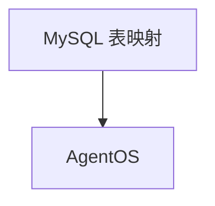

# mysql.md — 实现原理分析

> 源文件：`cookbook/05_agent_os/dbs/mysql.py`

## 概述

**`MySQLDb`（pymysql）+ `AsyncMySQLDb`（asyncmy）**；表名 session/eval/memory/metrics；默认 **`sync_agent_os`**。

## System Prompt 组装

同标准 basic agent。

## 完整 API 请求

`OpenAIChat`。

## Mermaid 流程图

## 关键源码文件索引

| 文件 | 作用 |
|------|------|
| `agno/db/mysql` | `MySQLDb` |
