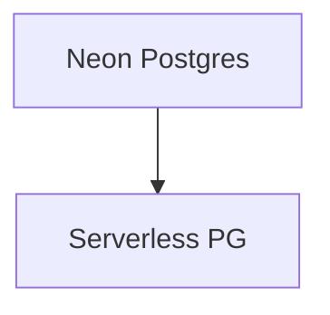

# neon.md — 实现原理分析

> 源文件：`cookbook/05_agent_os/dbs/neon.py`

## 概述

**`PostgresDb(db_url=NEON_DB_URL)`**，URL 来自 **`getenv("NEON_DB_URL")`**。**`agent` 未设置 `model`**；**`team` 有 model**。

## System Prompt 组装

无显式 instructions on agent。

## 完整 API 请求

主 agent 若缺 model 需运行时解析。

## Mermaid 流程图

## 关键源码文件索引

| 文件 | 作用 |
|------|------|
| `agno/db/postgres` | `PostgresDb` |
