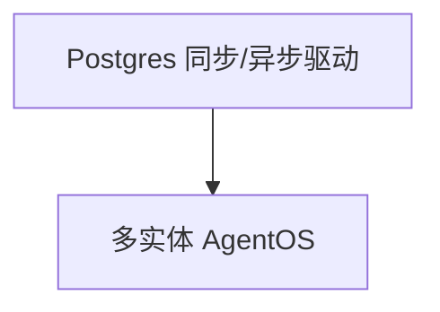

# postgres.py — 实现原理分析

> 源文件：`cookbook/05_agent_os/dbs/postgres.py`

## 概述

**同步 `PostgresDb`（psycopg）+ 异步 `AsyncPostgresDb`（psycopg_async）**；**sync** 侧含 **Team**；**async** 侧含 **Workflow**；默认 **`agent_os = sync_agent_os`**。

## System Prompt 组装

basic agent 无长 instructions；async agent 开 markdown/datetime。

## 完整 API 请求

`OpenAIChat`。

## Mermaid 流程图

## 关键源码文件索引

| 文件 | 作用 |
|------|------|
| `agno/db/postgres` | `PostgresDb`, `AsyncPostgresDb` |
