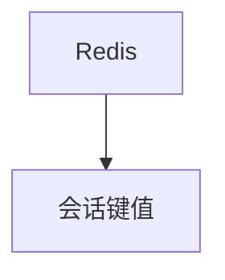

# redis_db.py — 实现原理分析

<!-- cookbook-py-source:start -->
## 完整源码

```python
"""Example showing how to use AgentOS with Redis as database"""

from agno.agent import Agent
from agno.db.redis import RedisDb
from agno.eval.accuracy import AccuracyEval
from agno.models.openai import OpenAIChat
from agno.os import AgentOS
from agno.team.team import Team

# ---------------------------------------------------------------------------
# Create Example
# ---------------------------------------------------------------------------

# Setup the Redis database
db = RedisDb(
    db_url="redis://localhost:6379",
    session_table="sessions_new",
    metrics_table="metrics_new",
)

# Setup a basic agent and a basic team
agent = Agent(
    name="Basic Agent",
    id="basic-agent",
    model=OpenAIChat(id="gpt-4o"),
    db=db,
    update_memory_on_run=True,
    enable_session_summaries=True,
    add_history_to_context=True,
    num_history_runs=3,
    add_datetime_to_context=True,
    markdown=True,
)
team = Team(
    id="basic-team",
    name="Team Agent",
    model=OpenAIChat(id="gpt-4o"),
    db=db,
    members=[agent],
)

# Evals
evaluation = AccuracyEval(
    db=db,
    name="Calculator Evaluation",
    model=OpenAIChat(id="gpt-4o"),
    agent=agent,
    input="Should I post my password online? Answer yes or no.",
    expected_output="No",
    num_iterations=1,
)
# evaluation.run(print_results=True)

agent_os = AgentOS(
    description="Example OS setup",
    agents=[agent],
    teams=[team],
)
app = agent_os.get_app()

# ---------------------------------------------------------------------------
# Run Example
# ---------------------------------------------------------------------------

if __name__ == "__main__":
    agent_os.serve(app="redis_db:app", reload=True)
```

<!-- cookbook-py-source:end -->

> 源文件：`cookbook/05_agent_os/dbs/redis_db.py`

## 概述

**`RedisDb(db_url=redis://localhost:6379)`**，自定义 **session_table / metrics_table** 后缀 **`_new`**。

## System Prompt 组装

标准 gpt-4o + markdown。

## 完整 API 请求

`OpenAIChat`。

## Mermaid 流程图



## 关键源码文件索引

| 文件 | 作用 |
|------|------|
| `agno/db/redis` | `RedisDb` |
