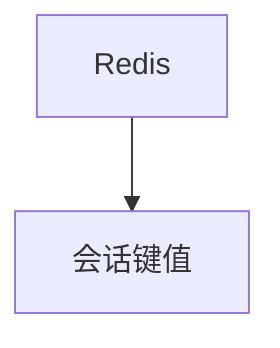

# redis_db.py — 实现原理分析

> 源文件：`cookbook/05_agent_os/dbs/redis_db.py`

## 概述

**`RedisDb(db_url=redis://localhost:6379)`**，自定义 **session_table / metrics_table** 后缀 **`_new`**。

## System Prompt 组装

标准 gpt-4o + markdown。

## 完整 API 请求

`OpenAIChat`。

## Mermaid 流程图

## 关键源码文件索引

| 文件 | 作用 |
|------|------|
| `agno/db/redis` | `RedisDb` |
