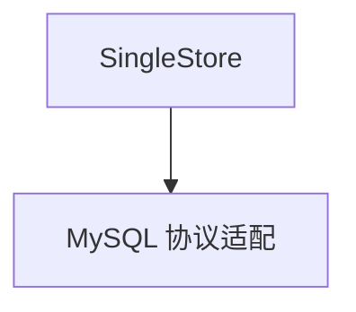

# singlestore.py — 实现原理分析

> 源文件：`cookbook/05_agent_os/dbs/singlestore.py`

## 概述

**`SingleStoreDb`** 使用 **MySQL 兼容 URL**；**`__main__` 先 `agent.run` 再 `serve`**。

## System Prompt 组装

无显式 instructions。

## 完整 API 请求

`OpenAIChat`。

## Mermaid 流程图

## 关键源码文件索引

| 文件 | 作用 |
|------|------|
| `agno/db/singlestore` | `SingleStoreDb` |
