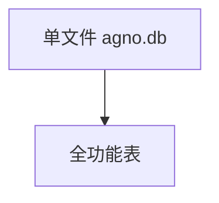

# sqlite.py — 实现原理分析

> 源文件：`cookbook/05_agent_os/dbs/sqlite.py`

## 概述

**`SqliteDb`** 显式 **session/eval/memory/metrics** 表名；**`AccuracyEval`**；**`team_agent` `debug_mode=True`**。

## System Prompt 组装

无长 instructions。

## 完整 API 请求

`OpenAIChat`。

## Mermaid 流程图

## 关键源码文件索引

| 文件 | 作用 |
|------|------|
| `agno/db/sqlite` | `SqliteDb` |
