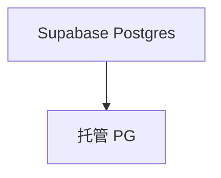

# supabase.py — 实现原理分析

> 源文件：`cookbook/05_agent_os/dbs/supabase.py`

## 概述

用 **`SUPABASE_PROJECT` + `SUPABASE_PASSWORD`** 拼 **`PostgresDb`** URL。**`agent` 无 model**。**`__main__` 先 `agent.run` 再 serve**。

## System Prompt 组装

无显式 instructions。

## 完整 API 请求

依赖模型解析。

## Mermaid 流程图

## 关键源码文件索引

| 文件 | 作用 |
|------|------|
| `agno/db/postgres` | `PostgresDb` |
