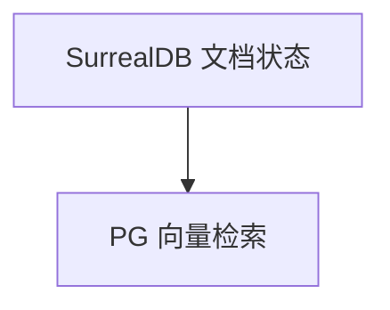

# surreal.py — 实现原理分析

> 源文件：`cookbook/05_agent_os/dbs/surreal.py`

## 概述

**`SurrealDb`**（WebSocket）+ **`PgVector`** 内容向量分离：**`Knowledge(contents_db=surreal, vector_db=pgvector)`**。**`agent` 带 knowledge，未设 `search_knowledge`**（需核对）。

## System Prompt 组装

无显式 instructions。

## 完整 API 请求

`OpenAIChat` + 检索管线若启用。

## Mermaid 流程图

## 关键源码文件索引

| 文件 | 作用 |
|------|------|
| `agno/db/surrealdb` | `SurrealDb` |
