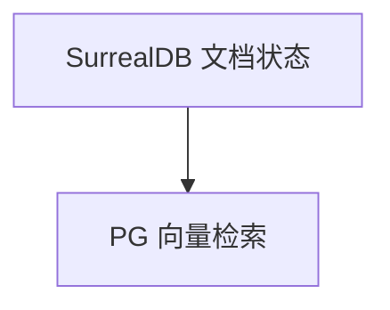

# surreal.py — 实现原理分析

<!-- cookbook-py-source:start -->
## 完整源码

```python
"""Example showing how to use AgentOS with SurrealDB as database"""

from agno.agent import Agent
from agno.db.surrealdb import SurrealDb
from agno.knowledge.knowledge import Knowledge
from agno.models.openai import OpenAIChat
from agno.os import AgentOS
from agno.team.team import Team
from agno.vectordb.pgvector import PgVector

# ---------------------------------------------------------------------------
# Create Example
# ---------------------------------------------------------------------------

# Setup the SurrealDB database
SURREALDB_URL = "ws://localhost:8000"
SURREALDB_USER = "root"
SURREALDB_PASSWORD = "root"
SURREALDB_NAMESPACE = "agno"
SURREALDB_DATABASE = "agent_os_demo"

creds = {"username": SURREALDB_USER, "password": SURREALDB_PASSWORD}
db = SurrealDb(None, SURREALDB_URL, creds, SURREALDB_NAMESPACE, SURREALDB_DATABASE)

db_url = "postgresql+psycopg://ai:ai@localhost:5532/ai"
vector_db = PgVector(table_name="agent_os_knowledge", db_url=db_url)

knowledge = Knowledge(
    contents_db=db,
    vector_db=vector_db,
    name="Agent OS Knowledge",
    description="Knowledge for Agent OS demo",
)

# Agent Setup
agent = Agent(
    db=db,
    name="Basic Agent",
    id="basic-agent",
    model=OpenAIChat(id="gpt-4o"),
    add_history_to_context=True,
    num_history_runs=3,
    knowledge=knowledge,
)

# Team Setup
team = Team(
    db=db,
    id="basic-team",
    name="Team Agent",
    model=OpenAIChat(id="gpt-4o"),
    members=[agent],
    add_history_to_context=True,
    num_history_runs=3,
)

# AgentOS Setup
agent_os = AgentOS(
    description="Example OS setup",
    agents=[agent],
    teams=[team],
)

# Get the app
app = agent_os.get_app()

# ---------------------------------------------------------------------------
# Run Example
# ---------------------------------------------------------------------------

if __name__ == "__main__":
    # Serve the app
    agent_os.serve(app="surreal:app", reload=True)
```

<!-- cookbook-py-source:end -->

> 源文件：`cookbook/05_agent_os/dbs/surreal.py`

## 概述

**`SurrealDb`**（WebSocket）+ **`PgVector`** 内容向量分离：**`Knowledge(contents_db=surreal, vector_db=pgvector)`**。**`agent` 带 knowledge，未设 `search_knowledge`**（需核对）。

## System Prompt 组装

无显式 instructions。

## 完整 API 请求

`OpenAIChat` + 检索管线若启用。

## Mermaid 流程图



## 关键源码文件索引

| 文件 | 作用 |
|------|------|
| `agno/db/surrealdb` | `SurrealDb` |
