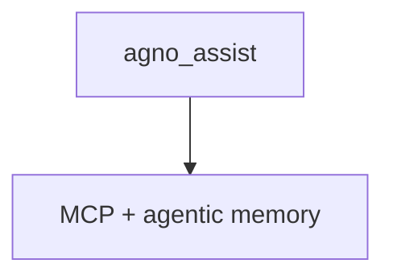

# agents.py — 实现原理分析

> 源文件：`cookbook/05_agent_os/dbs/surreal_db/agents.py`

## 概述

**`agno_assist`**：**`Claude` + `enable_agentic_memory=True` + MCP + 长 `description`/`instructions`（dedent）**；从 **`db`** 导入 **`SurrealDb`**。仅供 **`run.py`** import。

## System Prompt 组装

**description** 与 **instructions** 大块字面量（源 **L34-82**）；须原样复制进「还原」验证。

### 还原节选

```text
You are Agno Assist, an advanced AI Agent specializing in the Agno framework and the AgentOS.
...
```

（完整见源文件。）

## 完整 API 请求

`Claude` Messages API。

## Mermaid 流程图



## 关键源码文件索引

| 文件 | 作用 |
|------|------|
| `agno/db/surrealdb` | 会话 |
