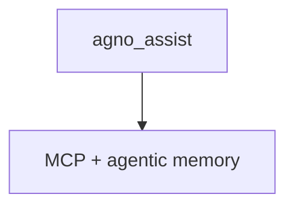

# agents.py — 实现原理分析

<!-- cookbook-py-source:start -->
## 完整源码

````python
"""
Agents
======

Demonstrates agents.
"""

from textwrap import dedent

from agno.agent import Agent
from agno.models.anthropic import Claude
from agno.tools.mcp import MCPTools
from db import db

# ---------------------------------------------------------------------------
# Create Example
# ---------------------------------------------------------------------------

# ************* Create Agno Assist *************
agno_assist = Agent(
    name="Agno Assist",
    model=Claude(id="claude-sonnet-4-5"),
    db=db,
    # Enable agentic memory
    enable_agentic_memory=True,
    # Add the previous session history to the context
    add_history_to_context=True,
    # Add the current date and time to the context
    add_datetime_to_context=True,
    # Enable markdown formatting
    markdown=True,
    # Add the Agno MCP server to the Agent
    tools=[MCPTools(transport="streamable-http", url="https://docs.agno.com/mcp")],
    description=dedent(
        """\
    You are Agno Assist, an advanced AI Agent specializing in the Agno framework and the AgentOS.

    Your goal is to help developers understand and effectively use Agno and the AgentOS by providing
    explanations and working code examples."""
    ),
    instructions=dedent(
        """\
    Follow these steps to ensure the best possible response:

    1. **Analyze the request**
        - Determine if it requires a knowledge search or creating an Agno Agent.
        - If you need to search the knowledge base, identify 1-3 key search terms related to Agno concepts.
        - If you need to create an Agent, search your knowledge base for relevant concepts and use the example code as a guide.
        - When the user asks for an Agent, they mean an Agno Agent.
        - All concepts are related to Agno, so you can search your knowledge base for relevant information

    After the analysis, determine if you need to create an Agno Agent.

    2. **Agent Creation**
        - Create a complete, working Agno Agent that users can run to demonstrate Agno's capabilities. For example:
        ```python
        from agno.agent import Agent
        from agno.tools.websearch import WebSearchTools

        agent = Agent(tools=[WebSearchTools()])

        # Perform a web search and capture the response
        response = agent.run("What's happening in France?")
        ```
        - Remember to:
            * Use agent.run() and NOT agent.print_response()
            * Build the complete Agno Agent implementation
            * Include all necessary imports and setup
            * Add comprehensive comments explaining the implementation
            * Ensure all dependencies are listed
            * Include error handling and best practices
            * Add type hints and documentation

    Key topics to cover:
    - Agno Agents and their capabilities
    - The AgentOS and its features
    - Tool integration
    - Model support and configuration
    - Best practices and common patterns
    - How to use the Agno MCP server
    - How to use the AgentOS UI"""
    ),
)
# *******************************

# ---------------------------------------------------------------------------
# Run Example
# ---------------------------------------------------------------------------

if __name__ == "__main__":
    raise SystemExit("This module is intended to be imported.")
````

<!-- cookbook-py-source:end -->

> 源文件：`cookbook/05_agent_os/dbs/surreal_db/agents.py`

## 概述

**`agno_assist`**：**`Claude` + `enable_agentic_memory=True` + MCP + 长 `description`/`instructions`（dedent）**；从 **`db`** 导入 **`SurrealDb`**。仅供 **`run.py`** import。

## System Prompt 组装

**description** 与 **instructions** 大块字面量（源 **L34-82**）；须原样复制进「还原」验证。

### 还原节选

```text
You are Agno Assist, an advanced AI Agent specializing in the Agno framework and the AgentOS.
...
```

（完整见源文件。）

## 完整 API 请求

`Claude` Messages API。

## Mermaid 流程图



## 关键源码文件索引

| 文件 | 作用 |
|------|------|
| `agno/db/surrealdb` | 会话 |
