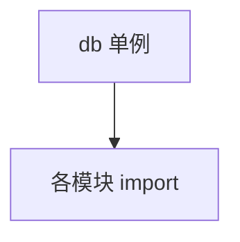

# db.py — 实现原理分析

<!-- cookbook-py-source:start -->
## 完整源码

```python
"""
Db
==

Demonstrates db.
"""

from agno.db.surrealdb import SurrealDb

# ---------------------------------------------------------------------------
# Create Example
# ---------------------------------------------------------------------------

# ************* SurrealDB Config *************
SURREALDB_URL = "ws://localhost:8000"
SURREALDB_USER = "root"
SURREALDB_PASSWORD = "root"
SURREALDB_NAMESPACE = "agno"
SURREALDB_DATABASE = "agent_os_demo"
# *******************************

# ************* Create the SurrealDB instance *************
creds = {"username": SURREALDB_USER, "password": SURREALDB_PASSWORD}
db = SurrealDb(None, SURREALDB_URL, creds, SURREALDB_NAMESPACE, SURREALDB_DATABASE)
# *******************************

# ---------------------------------------------------------------------------
# Run Example
# ---------------------------------------------------------------------------

if __name__ == "__main__":
    raise SystemExit("This module is intended to be imported.")
```

<!-- cookbook-py-source:end -->

> 源文件：`cookbook/05_agent_os/dbs/surreal_db/db.py`

## 概述

集中定义 **`SurrealDb`** 连接常量与 **`db` 单例**，供 **`agents.py` / `teams.py` / `workflows.py`** 引用。

## System Prompt 组装

无 Agent。

## 完整 API 请求

无。

## Mermaid 流程图



## 关键源码文件索引

| 文件 | 作用 |
|------|------|
| `agno/db/surrealdb` | `SurrealDb` |
