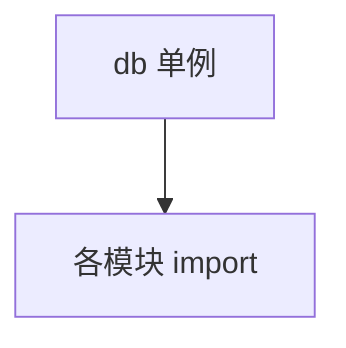

# db.py — 实现原理分析

> 源文件：`cookbook/05_agent_os/dbs/surreal_db/db.py`

## 概述

集中定义 **`SurrealDb`** 连接常量与 **`db` 单例**，供 **`agents.py` / `teams.py` / `workflows.py`** 引用。

## System Prompt 组装

无 Agent。

## 完整 API 请求

无。

## Mermaid 流程图

## 关键源码文件索引

| 文件 | 作用 |
|------|------|
| `agno/db/surrealdb` | `SurrealDb` |
