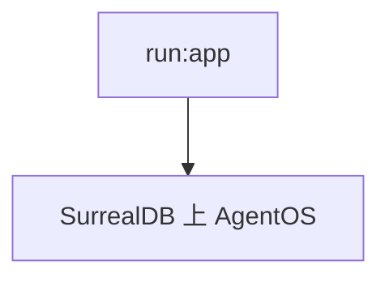

# run.py — 实现原理分析

<!-- cookbook-py-source:start -->
## 完整源码

```python
"""SurrealDB + AgentOS demo

Steps:
    1. Run SurrealDB in a container: `./cookbook/scripts/run_surrealdb.sh`
    2. Run the demo: `python cookbook/agent_os/dbs/surreal_db/run.py`
"""

from agents import agno_assist
from agno.os import AgentOS
from teams import reasoning_finance_team
from workflows import research_workflow

# ---------------------------------------------------------------------------
# Create Example
# ---------------------------------------------------------------------------

# ************* Create the AgentOS *************
agent_os = AgentOS(
    description="SurrealDB AgentOS",
    agents=[agno_assist],
    teams=[reasoning_finance_team],
    workflows=[research_workflow],
)
# Get the FastAPI app for the AgentOS
app = agent_os.get_app()
# *******************************

# ************* Run the AgentOS *************
# ---------------------------------------------------------------------------
# Run Example
# ---------------------------------------------------------------------------

if __name__ == "__main__":
    agent_os.serve(app="run:app", reload=True)
# *******************************
```

<!-- cookbook-py-source:end -->

> 源文件：`cookbook/05_agent_os/dbs/surreal_db/run.py`

## 概述

组装 **`AgentOS`**：**`agents=[agno_assist]`**，**`teams=[reasoning_finance_team]`**，**`workflows=[research_workflow]`**，**`app="run:app"`**。

## System Prompt 组装

见各子模块。

## 完整 API 请求

多模型：**OpenAI** 与 **Claude** 混合（team/workflow）。

## Mermaid 流程图



## 关键源码文件索引

| 文件 | 作用 |
|------|------|
| `agno/os` | `AgentOS` |
