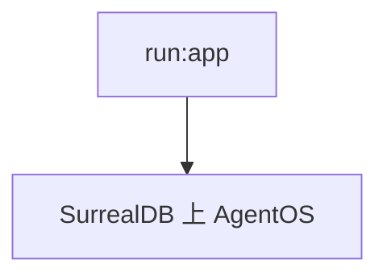

# run.py — 实现原理分析

> 源文件：`cookbook/05_agent_os/dbs/surreal_db/run.py`

## 概述

组装 **`AgentOS`**：**`agents=[agno_assist]`**，**`teams=[reasoning_finance_team]`**，**`workflows=[research_workflow]`**，**`app="run:app"`**。

## System Prompt 组装

见各子模块。

## 完整 API 请求

多模型：**OpenAI** 与 **Claude** 混合（team/workflow）。

## Mermaid 流程图

## 关键源码文件索引

| 文件 | 作用 |
|------|------|
| `agno/os` | `AgentOS` |
