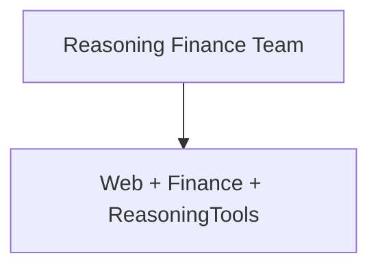

# teams.py — 实现原理分析

> 源文件：`cookbook/05_agent_os/dbs/surreal_db/teams.py`

## 概述

**`reasoning_finance_team`**：**web_agent（WebSearch）+ finance_agent（YFinance）**，**`ReasoningTools(add_instructions=True)`**，长 **Team instructions**（含「勿用 emoji」），**`show_members_responses=True`**。含 **DEMO SCENARIOS** 注释块。

## System Prompt 组装

成员与 Team 字面量见源 **L29-77**；Team 级多条 instructions。

## 完整 API 请求

`OpenAIChat` gpt-4.1。

## Mermaid 流程图

## 关键源码文件索引

| 文件 | 作用 |
|------|------|
| `agno/team/team.py` | `Team` |
