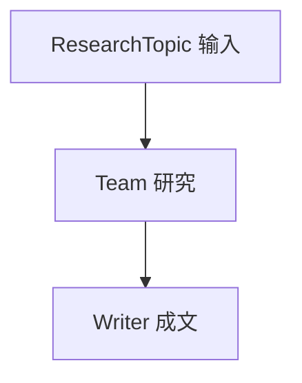

# workflows.py — 实现原理分析

> 源文件：`cookbook/05_agent_os/dbs/surreal_db/workflows.py`

## 概述

**`ResearchTopic` Pydantic** 作 **`Workflow.input_schema`**；**`research_team`**（Wikipedia + Firecrawl 两 Agent）→ **`writer_agent`**；**`research_workflow`**：`Step(team=...)` → `Step(agent=...)`。

## System Prompt 组装

各 Agent：`role`/`instructions` 见源；Workflow 无单独 LLM。

## 完整 API 请求

**`Claude`** Messages（多 `claude-sonnet` 变体）。

## Mermaid 流程图

## 关键源码文件索引

| 文件 | 作用 |
|------|------|
| `agno/workflow/workflow.py` | `input_schema` |
