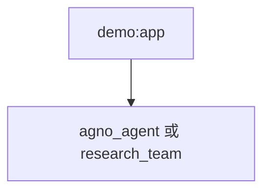

# demo.py — 实现原理分析

> 源文件：`cookbook/05_agent_os/demo.py`

## 概述

**`PostgresDb` + `PgVector` + `Knowledge`**；**`agno_agent`**：**MCP + knowledge + db + update_memory**；**`simple_agent` / `research_agent`**；**`research_team`**（research + simple）。**`AgentOS`** 注册 **agno_agent + research_team**（**未**把 simple/research 单独列入顶层 agents，仅通过 Team 暴露）。

**核心配置一览：**

| 配置项 | 值 | 说明 |
|--------|------|------|
| `agno_agent.model` | `gpt-4.1` | MCP 文档助手 |
| `research_team.model` | `gpt-4.1` | Team 协调 |
| `research_agent.tools` | `WebSearchTools()` | 搜索 |

## System Prompt 组装

**research_team.instructions**：`["You are the lead researcher of a research team."]`  
**research_agent / simple_agent**：短 instructions 列表。

### agno_agent

无显式 instructions；依赖 MCP 与 knowledge 运行时行为。

## 完整 API 请求

`OpenAIChat` Chat Completions。

## Mermaid 流程图

## 关键源码文件索引

| 文件 | 作用 |
|------|------|
| `agno/os` | `AgentOS` |
