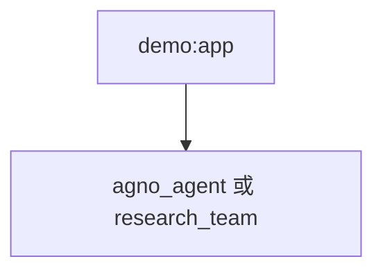

# demo.py — 实现原理分析

<!-- cookbook-py-source:start -->
## 完整源码

```python
"""
AgentOS Demo

Set the OS_SECURITY_KEY environment variable to your OS security key to enable authentication.

Prerequisites:
uv pip install -U fastapi uvicorn sqlalchemy pgvector psycopg openai ddgs yfinance
"""

from agno.agent import Agent
from agno.db.postgres import PostgresDb
from agno.knowledge.knowledge import Knowledge
from agno.models.openai import OpenAIChat
from agno.os import AgentOS
from agno.team import Team
from agno.tools.mcp import MCPTools
from agno.tools.websearch import WebSearchTools
from agno.vectordb.pgvector import PgVector

# ---------------------------------------------------------------------------
# Create Example
# ---------------------------------------------------------------------------

# Database connection
db_url = "postgresql+psycopg://ai:ai@localhost:5532/ai"

# Create Postgres-backed memory store
db = PostgresDb(db_url=db_url)

# Create Postgres-backed vector store
vector_db = PgVector(
    db_url=db_url,
    table_name="agno_docs",
)
knowledge = Knowledge(
    name="Agno Docs",
    contents_db=db,
    vector_db=vector_db,
)

# Create your agents
agno_agent = Agent(
    name="Agno Agent",
    model=OpenAIChat(id="gpt-4.1"),
    tools=[MCPTools(transport="streamable-http", url="https://docs.agno.com/mcp")],
    db=db,
    update_memory_on_run=True,
    knowledge=knowledge,
    markdown=True,
)

simple_agent = Agent(
    name="Simple Agent",
    role="Simple agent",
    id="simple_agent",
    model=OpenAIChat(id="gpt-5.2"),
    instructions=["You are a simple agent"],
    db=db,
    update_memory_on_run=True,
)

research_agent = Agent(
    name="Research Agent",
    role="Research agent",
    id="research_agent",
    model=OpenAIChat(id="gpt-5.2"),
    instructions=["You are a research agent"],
    tools=[WebSearchTools()],
    db=db,
    update_memory_on_run=True,
)

# Create a team
research_team = Team(
    name="Research Team",
    description="A team of agents that research the web",
    members=[research_agent, simple_agent],
    model=OpenAIChat(id="gpt-4.1"),
    id="research_team",
    instructions=[
        "You are the lead researcher of a research team.",
    ],
    db=db,
    update_memory_on_run=True,
    add_datetime_to_context=True,
    markdown=True,
)

# Create the AgentOS
agent_os = AgentOS(
    id="agentos-demo",
    agents=[agno_agent],
    teams=[research_team],
)
app = agent_os.get_app()


# ---------------------------------------------------------------------------
# Run Example
# ---------------------------------------------------------------------------

if __name__ == "__main__":
    agent_os.serve(app="demo:app", port=7777, reload=True)
```

<!-- cookbook-py-source:end -->

> 源文件：`cookbook/05_agent_os/demo.py`

## 概述

**`PostgresDb` + `PgVector` + `Knowledge`**；**`agno_agent`**：**MCP + knowledge + db + update_memory**；**`simple_agent` / `research_agent`**；**`research_team`**（research + simple）。**`AgentOS`** 注册 **agno_agent + research_team**（**未**把 simple/research 单独列入顶层 agents，仅通过 Team 暴露）。

**核心配置一览：**

| 配置项 | 值 | 说明 |
|--------|------|------|
| `agno_agent.model` | `gpt-4.1` | MCP 文档助手 |
| `research_team.model` | `gpt-4.1` | Team 协调 |
| `research_agent.tools` | `WebSearchTools()` | 搜索 |

## System Prompt 组装

**research_team.instructions**：`["You are the lead researcher of a research team."]`  
**research_agent / simple_agent**：短 instructions 列表。

### agno_agent

无显式 instructions；依赖 MCP 与 knowledge 运行时行为。

## 完整 API 请求

`OpenAIChat` Chat Completions。

## Mermaid 流程图



## 关键源码文件索引

| 文件 | 作用 |
|------|------|
| `agno/os` | `AgentOS` |
