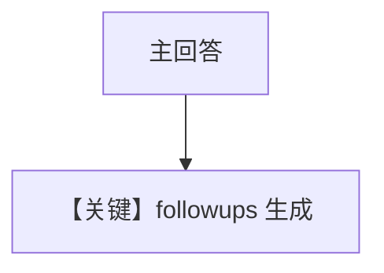

# followups_agentos.py — 实现原理分析

> 源文件：`cookbook/05_agent_os/followup/followups_agentos.py`

## 概述

**`followups=True`，`num_followups=3`** 在 **Agent** 与 **Team** 上同时启用；**`OpenAIResponses`**；**`PostgresDb`** URL 为 **`postgresql://`**（非 psycopg 前缀，与环境有关）。

**核心配置一览：**

| 配置项 | 值 | 说明 |
|--------|------|------|
| `instructions` | 同一句助手描述 | Agent 与 Team |
| `AgentOS` | `id="followups-agentos"`，`db=db` | OS 级 DB |

## System Prompt 组装

```text
You are a knowledgeable assistant. Answer questions thoroughly.

```

**followups** 机制会在 **`get_system_message` 或 run 后处理** 中追加后续问题生成逻辑（以框架实现为准）。

## 完整 API 请求

**`OpenAIResponses`** → Responses API。

## Mermaid 流程图



## 关键源码文件索引

| 文件 | 作用 |
|------|------|
| `agno/agent/agent.py` | `followups`, `num_followups` |
