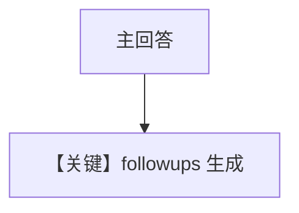

# followups_agentos.py — 实现原理分析

<!-- cookbook-py-source:start -->
## 完整源码

```python
from agno.agent import Agent
from agno.db.postgres import PostgresDb
from agno.models.openai import OpenAIResponses
from agno.os import AgentOS
from agno.team.team import Team

db = PostgresDb(db_url="postgresql://ai:ai@localhost:5532/ai")

# ---------------------------------------------------------------------------
# Create the Agent — just set followups=True
# ---------------------------------------------------------------------------
agent = Agent(
    name="Followups Agent",
    id="followup-suggestions-agent",
    model=OpenAIResponses(id="gpt-4o"),
    instructions="You are a knowledgeable assistant. Answer questions thoroughly.",
    # Enable built-in followups
    followups=True,
    num_followups=3,
    # Optionally use a cheaper model for followups
    # followup_model=OpenAIResponses(id="gpt-4o-mini"),
    markdown=True,
    db=db,
)
team = Team(
    id="followups-team",
    name="Followups Team",
    model=OpenAIResponses(id="gpt-4o"),
    members=[agent],
    instructions="You are a knowledgeable assistant. Answer questions thoroughly.",
    # Enable built-in followups
    followups=True,
    num_followups=3,
    # Optionally use a cheaper model for followups
    # followup_model=OpenAIResponses(id="gpt-4o-mini"),
    markdown=True,
    db=db,
)

agno_os = AgentOS(
    id="followups-agentos",
    name="Followups AgentOS",
    agents=[agent],
    teams=[team],
    db=db,
)
app = agno_os.get_app()
if __name__ == "__main__":
    agno_os.serve(app="followups_agentos:app", reload=True)
```

<!-- cookbook-py-source:end -->

> 源文件：`cookbook/05_agent_os/followup/followups_agentos.py`

## 概述

**`followups=True`，`num_followups=3`** 在 **Agent** 与 **Team** 上同时启用；**`OpenAIResponses`**；**`PostgresDb`** URL 为 **`postgresql://`**（非 psycopg 前缀，与环境有关）。

**核心配置一览：**

| 配置项 | 值 | 说明 |
|--------|------|------|
| `instructions` | 同一句助手描述 | Agent 与 Team |
| `AgentOS` | `id="followups-agentos"`，`db=db` | OS 级 DB |

## System Prompt 组装

```text
You are a knowledgeable assistant. Answer questions thoroughly.

```

**followups** 机制会在 **`get_system_message` 或 run 后处理** 中追加后续问题生成逻辑（以框架实现为准）。

## 完整 API 请求

**`OpenAIResponses`** → Responses API。

## Mermaid 流程图



## 关键源码文件索引

| 文件 | 作用 |
|------|------|
| `agno/agent/agent.py` | `followups`, `num_followups` |
