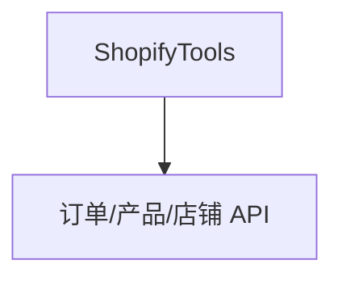

# shopify_demo.py — 实现原理分析

> 源文件：`cookbook/05_agent_os/integrations/shopify_demo.py`

## 概述

**`ShopifyTools()`** + **`AgentOSConfig(chat=ChatConfig(quick_prompts={...}))`** 预置快捷提示。**环境变量**：`SHOPIFY_SHOP_NAME`、`SHOPIFY_ACCESS_TOKEN`。

**核心配置一览：**

| 配置项 | 值 | 说明 |
|--------|------|------|
| `sales_agent.model` | `gpt-5.2` | 分析 |
| `instructions` | 多行销售分析流程 | 见源 L37-47 |
| `markdown` / `add_datetime_to_context` | True | 格式与时间 |

## System Prompt 组装

多行 `instructions` 列表须原样还原（含 `get_shop_info` 工具名提示）。

## 完整 API 请求

`OpenAIChat` + Shopify REST（经 tools）。

## Mermaid 流程图

## 关键源码文件索引

| 文件 | 作用 |
|------|------|
| `agno/tools/shopify` | `ShopifyTools` |
| `agno/os/config` | `AgentOSConfig`, `ChatConfig` |
