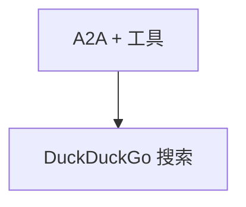

# agent_with_tools.py — 实现原理分析

> 源文件：`cookbook/05_agent_os/interfaces/a2a/agent_with_tools.py`

## 概述

**`WebSearchTools` + 长 description + 多行 instructions**；**`add_location_to_context=True`**，**`timezone_identifier="Etc/UTC"`**；**`debug_mode=True`**；**`a2a_interface=True`**。

## System Prompt 组装

**instructions** 三引号块（源 L23-30）须完整还原；**description** 单行（L22）。

## 完整 API 请求

`OpenAIChat` + 工具循环。

## Mermaid 流程图

## 关键源码文件索引

| 文件 | 作用 |
|------|------|
| `agno/tools/websearch` | `WebSearchTools` |
