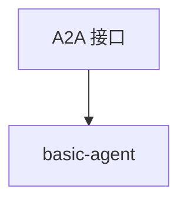

# basic.py — 实现原理分析

<!-- cookbook-py-source:start -->
## 完整源码

```python
"""
Basic
=====

Demonstrates basic.
"""

from agno.agent.agent import Agent
from agno.models.openai import OpenAIChat
from agno.os import AgentOS

# ---------------------------------------------------------------------------
# Create Example
# ---------------------------------------------------------------------------

chat_agent = Agent(
    name="basic-agent",
    model=OpenAIChat(id="gpt-4o"),
    id="basic_agent",
    description="A helpful and responsive AI assistant that provides thoughtful answers and assistance with a wide range of topics",
    instructions="You are a helpful AI assistant.",
    add_datetime_to_context=True,
    markdown=True,
)

# Setup your AgentOS app
agent_os = AgentOS(
    agents=[chat_agent],
    a2a_interface=True,
)
app = agent_os.get_app()


# ---------------------------------------------------------------------------
# Run Example
# ---------------------------------------------------------------------------

if __name__ == "__main__":
    """Run your AgentOS with A2A interface.

    You can run the Agent via A2A protocol:
    POST http://localhost:7777/agents/{id}/v1/message:send
    For streaming responses:
    POST http://localhost:7777/agents/{id}/v1/message:stream
    Retrieve the agent card at:
    GET  http://localhost:7777/agents/{id}/.well-known/agent-card.json

    """
    agent_os.serve(app="basic:app", reload=True, port=7777)
```

<!-- cookbook-py-source:end -->

> 源文件：`cookbook/05_agent_os/interfaces/a2a/basic.py`

## 概述

**`a2a_interface=True`** 的极简 AgentOS：**`basic-agent`**，**`gpt-4o`**，**description + instructions**，端口 **7777**。

## System Prompt 组装

```text
A helpful and responsive AI assistant that provides thoughtful answers...
```
（description 全文见源 L20）

```text
You are a helpful AI assistant.

```

及 markdown、时间附加。

## 完整 API 请求

`OpenAIChat` Chat Completions；A2A 路径见 docstring。

## Mermaid 流程图



## 关键源码文件索引

| 文件 | 作用 |
|------|------|
| `agno/os` | `a2a_interface` |
