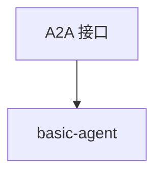

# basic.py — 实现原理分析

> 源文件：`cookbook/05_agent_os/interfaces/a2a/basic.py`

## 概述

**`a2a_interface=True`** 的极简 AgentOS：**`basic-agent`**，**`gpt-4o`**，**description + instructions**，端口 **7777**。

## System Prompt 组装

```text
A helpful and responsive AI assistant that provides thoughtful answers...
```
（description 全文见源 L20）

```text
You are a helpful AI assistant.

```

及 markdown、时间附加。

## 完整 API 请求

`OpenAIChat` Chat Completions；A2A 路径见 docstring。

## Mermaid 流程图



## 关键源码文件索引

| 文件 | 作用 |
|------|------|
| `agno/os` | `a2a_interface` |
