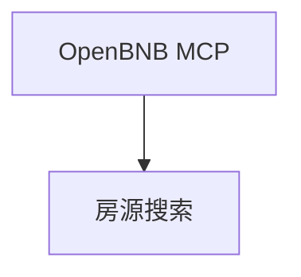

# airbnb_agent.py — 实现原理分析

> 源文件：`cookbook/05_agent_os/interfaces/a2a/multi_agent_a2a/airbnb_agent.py`

## 概述

**`MCPTools("npx -y @openbnb/mcp-server-airbnb --ignore-robots-txt")`**；**`markdown=False`**；**`a2a_interface=True`**，端口 **7774**。

## System Prompt 组装

**instructions**（dedent，源 L25-30）：

```text
You are an expert travel assistant.
Use the 'airbnb_search' tool to find properties based on location, dates, and people.
For detailed listing information, use 'airbnb_listing_details'.
Always provide location, price, and a link in your final response.
```

**description** 见源 L22。

## 完整 API 请求

`OpenAIChat` + MCP stdio 工具。

## Mermaid 流程图



## 关键源码文件索引

| 文件 | 作用 |
|------|------|
| `agno/tools/mcp` | `MCPTools` |
