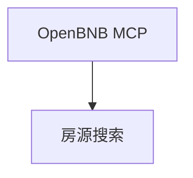

# airbnb_agent.py — 实现原理分析

<!-- cookbook-py-source:start -->
## 完整源码

```python
"""
Airbnb Agent
============

Demonstrates airbnb agent.
"""

from textwrap import dedent

from agno.agent import Agent
from agno.models.openai import OpenAIChat
from agno.os import AgentOS
from agno.tools.mcp import MCPTools

# ---------------------------------------------------------------------------
# Create Example
# ---------------------------------------------------------------------------

airbnb_agent = Agent(
    id="airbnb-search-agent",
    name="Airbnb Search Agent",
    description="A specialized agent for finding and detailing Airbnb listings using the OpenBNB MCP server.",
    model=OpenAIChat(id="gpt-4o"),
    tools=[MCPTools("npx -y @openbnb/mcp-server-airbnb --ignore-robots-txt")],
    instructions=dedent("""
        You are an expert travel assistant.
        Use the 'airbnb_search' tool to find properties based on location, dates, and people.
        For detailed listing information, use 'airbnb_listing_details'.
        Always provide location, price, and a link in your final response.
    """),
    markdown=False,
)

agent_os = AgentOS(
    id="airbnb-agent-os",
    description="An AgentOS serving specialized Agent for Airbnb search",
    agents=[
        airbnb_agent,
    ],
    a2a_interface=True,
)
app = agent_os.get_app()


# ---------------------------------------------------------------------------
# Run Example
# ---------------------------------------------------------------------------

if __name__ == "__main__":
    """Run your AgentOS.
    You can run the Agent via A2A protocol:
    POST http://localhost:7774/agents/{id}/v1/message:send
    For streaming responses:
    POST http://localhost:7774/agents/{id}/v1/message:stream
    Retrieve the agent card at:
    GET  http://localhost:7774/agents/{id}/.well-known/agent-card.json
    """
    agent_os.serve(app="airbnb_agent:app", port=7774, reload=True)
```

<!-- cookbook-py-source:end -->

> 源文件：`cookbook/05_agent_os/interfaces/a2a/multi_agent_a2a/airbnb_agent.py`

## 概述

**`MCPTools("npx -y @openbnb/mcp-server-airbnb --ignore-robots-txt")`**；**`markdown=False`**；**`a2a_interface=True`**，端口 **7774**。

## System Prompt 组装

**instructions**（dedent，源 L25-30）：

```text
You are an expert travel assistant.
Use the 'airbnb_search' tool to find properties based on location, dates, and people.
For detailed listing information, use 'airbnb_listing_details'.
Always provide location, price, and a link in your final response.
```

**description** 见源 L22。

## 完整 API 请求

`OpenAIChat` + MCP stdio 工具。

## Mermaid 流程图



## 关键源码文件索引

| 文件 | 作用 |
|------|------|
| `agno/tools/mcp` | `MCPTools` |
