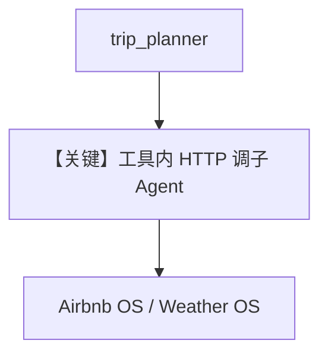

# trip_planning_a2a_client.py — 实现原理分析

> 源文件：`cookbook/05_agent_os/interfaces/a2a/multi_agent_a2a/trip_planning_a2a_client.py`

## 概述

**编排器模式**：**`ask_airbnb_agent` / `ask_weather_agent`** 为普通 Python 函数，内部 **`requests.post`** JSON-RPC 到 **localhost:7774 / 7770** 的 **A2A `message:send`**；**`trip_planner`** Agent **`tools=[ask_airbnb_agent, ask_weather_agent]`**，指令要求**先天气再住宿**。

## System Prompt 组装

**instructions** 列表（源 L98-104）须完整还原；**description**（L97）。

## 完整 API 请求

- 编排：`OpenAIChat` Chat Completions + function 式工具。  
- 子 Agent：各远端 A2A HTTP。

## Mermaid 流程图

## 关键源码文件索引

| 文件 | 作用 |
|------|------|
| `agno/tools` | 可调用函数作 tool |
