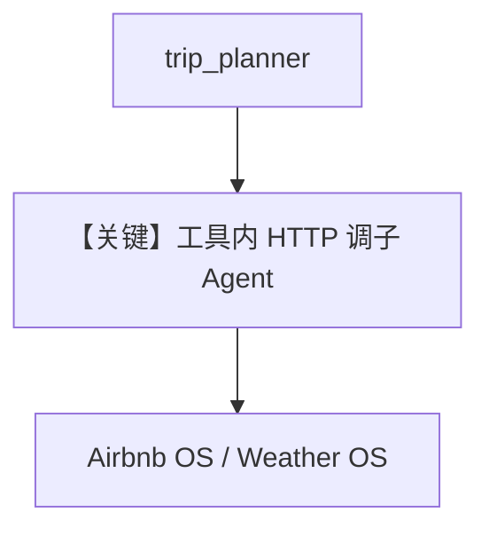

# trip_planning_a2a_client.py — 实现原理分析

<!-- cookbook-py-source:start -->
## 完整源码

```python
"""
Trip Planning A2A Client
========================

Demonstrates trip planning a2a client.
"""

import uuid

import requests
from agno.agent import Agent
from agno.models.openai import OpenAIChat
from agno.os import AgentOS

# ---------------------------------------------------------------------------
# Create Example
# ---------------------------------------------------------------------------


# --- 1. A2A Helper Function (The Protocol) ---
def _send_a2a_message(url: str, text: str) -> str:
    """
    Internal helper to send a message using your A2A JSON-RPC format.
    """
    payload = {
        "id": "trip_planner_client",
        "jsonrpc": "2.0",
        "method": "message/send",
        "params": {
            "message": {
                "message_id": str(uuid.uuid4()),
                "role": "user",
                "parts": [{"text": text}],
            }
        },
    }

    try:
        # Send POST request
        response = requests.post(url, json=payload, timeout=30)
        response.raise_for_status()
        data = response.json()

        # Unwrap the specific A2A response structure
        # result -> history -> last_item -> parts -> first_item -> text
        if "result" in data and "history" in data["result"]:
            history = data["result"]["history"]
            if history:
                last_msg = history[-1]
                if "parts" in last_msg and last_msg["parts"]:
                    return last_msg["parts"][0]["text"]

        return f"System Error: The agent at {url} responded, but no text message was found in the history."

    except Exception as e:
        return f"Connection Error: Could not talk to agent at {url}. Details: {e}"


# --- 2. The Two Tool Functions ---


def ask_airbnb_agent(request: str) -> str:
    """
    Contacts the specialized Airbnb Agent to find listings or get details.

    Args:
        request (str): A natural language request (e.g., "Find a 2-bed apartment in Paris for under $200").
    """
    # URL for the Airbnb Agent Service
    AIRBNB_URL = "http://localhost:7774/a2a/agents/airbnb-search-agent/v1/message:send"
    return _send_a2a_message(AIRBNB_URL, request)


def ask_weather_agent(request: str) -> str:
    """
    Contacts the specialized Weather Agent to get forecasts or current conditions.

    Args:
        request (str): A natural language request (e.g., "What is the weather in Tokyo next week?").
    """
    # URL for the Weather Agent Service
    WEATHER_URL = (
        "http://localhost:7770/a2a/agents/weather-reporter-agent/v1/message:send"
    )
    return _send_a2a_message(WEATHER_URL, request)


# --- 3. The Main Trip Planning Agent ---

trip_planner = Agent(
    name="Trip Planner",
    id="trip_planner",
    model=OpenAIChat(id="gpt-4o"),
    # Give the agent the tools we just created
    tools=[ask_airbnb_agent, ask_weather_agent],
    markdown=True,
    description="You are an expert Trip Planner orchestrator.",
    instructions=[
        "You help users plan complete trips by coordinating with specialized agents.",
        "1. Always check the weather for the destination/dates FIRST using 'ask_weather_agent'.",
        "2. Based on the weather suitability, search for accommodation using 'ask_airbnb_agent'.",
        "3. Synthesize the information from both agents into a final itinerary proposal.",
        "If an agent returns an error, inform the user and try to proceed with the available information.",
    ],
)
agent_os = AgentOS(
    id="trip-planning-service",
    description="AgentOS hosting the Trip Planning Orchestrator.",
    agents=[
        trip_planner,
    ],
)
app = agent_os.get_app()
# ---------------------------------------------------------------------------
# Run Example
# ---------------------------------------------------------------------------

if __name__ == "__main__":
    """Run your AgentOS.
    You can run the Agent via A2A protocol:
    POST http://localhost:7777/agents/{id}/v1/message:send
    For streaming responses:
    POST http://localhost:7777/agents/{id}/v1/message:stream
    Retrieve the agent card at:
    GET  http://localhost:7777/agents/{id}/.well-known/agent-card.json
    """
    agent_os.serve(app="trip_planning_a2a_client:app", port=7777, reload=True)
```

<!-- cookbook-py-source:end -->

> 源文件：`cookbook/05_agent_os/interfaces/a2a/multi_agent_a2a/trip_planning_a2a_client.py`

## 概述

**编排器模式**：**`ask_airbnb_agent` / `ask_weather_agent`** 为普通 Python 函数，内部 **`requests.post`** JSON-RPC 到 **localhost:7774 / 7770** 的 **A2A `message:send`**；**`trip_planner`** Agent **`tools=[ask_airbnb_agent, ask_weather_agent]`**，指令要求**先天气再住宿**。

## System Prompt 组装

**instructions** 列表（源 L98-104）须完整还原；**description**（L97）。

## 完整 API 请求

- 编排：`OpenAIChat` Chat Completions + function 式工具。  
- 子 Agent：各远端 A2A HTTP。

## Mermaid 流程图



## 关键源码文件索引

| 文件 | 作用 |
|------|------|
| `agno/tools` | 可调用函数作 tool |
