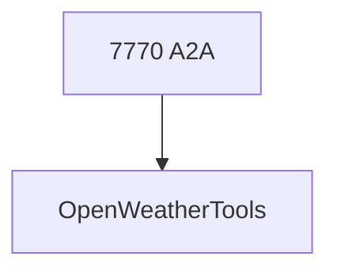

# weather_agent.py — 实现原理分析

<!-- cookbook-py-source:start -->
## 完整源码

```python
"""
Weather Agent
=============

Demonstrates weather agent.
"""

from textwrap import dedent

from agno.agent import Agent
from agno.models.openai import OpenAIChat
from agno.os import AgentOS
from agno.tools.openweather import OpenWeatherTools

# ---------------------------------------------------------------------------
# Create Example
# ---------------------------------------------------------------------------

weather_agent = Agent(
    id="weather-reporter-agent",
    name="Weather Reporter Agent",
    description="An agent that provides up-to-date weather information for any city.",
    model=OpenAIChat(id="gpt-5.2"),
    tools=[
        OpenWeatherTools(
            units="standard"  # Can be 'standard', 'metric', 'imperial'
        )
    ],
    instructions=dedent("""
        You are a concise weather reporter.
        Use the 'get_current_weather' tool to fetch current conditions.
        Respond with the temperature and a brief summary.
    """),
    markdown=True,
)
agent_os = AgentOS(
    id="weather-agent-os",
    description="An AgentOS serving specialized Agent for weather Reporting",
    agents=[
        weather_agent,
    ],
    a2a_interface=True,
)
app = agent_os.get_app()

# ---------------------------------------------------------------------------
# Run Example
# ---------------------------------------------------------------------------

if __name__ == "__main__":
    """Run your AgentOS.
    You can run the Agent via A2A protocol:
    POST http://localhost:7770/agents/{id}/v1/message:send
    For streaming responses:
    POST http://localhost:7770/agents/{id}/v1/message:stream
    Retrieve the agent card at:
    GET  http://localhost:7770/agents/{id}/.well-known/agent-card.json
    """
    agent_os.serve(app="weather_agent:app", port=7770, reload=True)
```

<!-- cookbook-py-source:end -->

> 源文件：`cookbook/05_agent_os/interfaces/a2a/multi_agent_a2a/weather_agent.py`

## 概述

**`OpenWeatherTools(units="standard")`**；**`gpt-5.2`**；**`a2a_interface=True`**，端口 **7770**。

## System Prompt 组装

**instructions**（dedent 源 L29-33）：

```text
You are a concise weather reporter.
Use the 'get_current_weather' tool to fetch current conditions.
Respond with the temperature and a brief summary.
```

## 完整 API 请求

`OpenAIChat` + OpenWeather API（经工具）。

## Mermaid 流程图



## 关键源码文件索引

| 文件 | 作用 |
|------|------|
| `agno/tools/openweather` | `OpenWeatherTools` |
