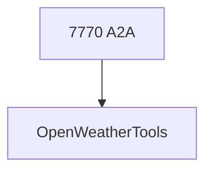

# weather_agent.py — 实现原理分析

> 源文件：`cookbook/05_agent_os/interfaces/a2a/multi_agent_a2a/weather_agent.py`

## 概述

**`OpenWeatherTools(units="standard")`**；**`gpt-5.2`**；**`a2a_interface=True`**，端口 **7770**。

## System Prompt 组装

**instructions**（dedent 源 L29-33）：

```text
You are a concise weather reporter.
Use the 'get_current_weather' tool to fetch current conditions.
Respond with the temperature and a brief summary.
```

## 完整 API 请求

`OpenAIChat` + OpenWeather API（经工具）。

## Mermaid 流程图



## 关键源码文件索引

| 文件 | 作用 |
|------|------|
| `agno/tools/openweather` | `OpenWeatherTools` |
