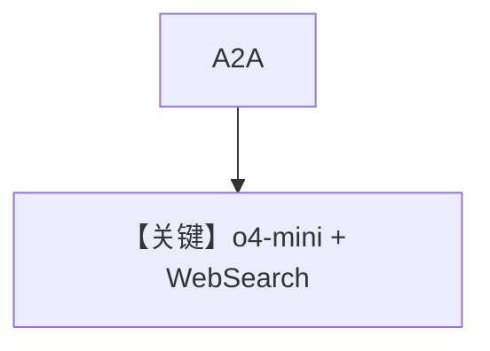

# reasoning_agent.py — 实现原理分析

<!-- cookbook-py-source:start -->
## 完整源码

```python
"""
Reasoning Agent
===============

Demonstrates reasoning agent.
"""

from agno.agent.agent import Agent
from agno.models.openai import OpenAIChat
from agno.os import AgentOS
from agno.tools.websearch import WebSearchTools

# ---------------------------------------------------------------------------
# Create Example
# ---------------------------------------------------------------------------

reasoning_agent = Agent(
    name="reasoning-agent",
    id="reasoning_agent",
    model=OpenAIChat(id="o4-mini"),
    description="An advanced AI assistant with deep reasoning and analytical capabilities, enhanced with real-time web search to deliver thorough, well-thought-out responses with contextual awareness",
    instructions="You are a helpful AI assistant with reasoning capabilities.",
    add_datetime_to_context=True,
    add_history_to_context=True,
    add_location_to_context=True,
    timezone_identifier="Etc/UTC",
    markdown=True,
    tools=[WebSearchTools()],
)

# Setup your AgentOS app
agent_os = AgentOS(
    agents=[reasoning_agent],
    a2a_interface=True,
)
app = agent_os.get_app()


# ---------------------------------------------------------------------------
# Run Example
# ---------------------------------------------------------------------------

if __name__ == "__main__":
    """Run your AgentOS with A2A interface.
    You can run the Agent via A2A protocol:
    POST http://localhost:7777/agents/{id}/v1/message:send
    For streaming responses:
    POST http://localhost:7777/agents/{id}/v1/message:stream
    Retrieve the agent card at:
    GET  http://localhost:7777/agents/{id}/.well-known/agent-card.json
    """
    agent_os.serve(app="reasoning_agent:app", reload=True, port=7777)
```

<!-- cookbook-py-source:end -->

> 源文件：`cookbook/05_agent_os/interfaces/a2a/reasoning_agent.py`

## 概述

**`OpenAIChat(id="o4-mini")` + `WebSearchTools`**；**长 `description`**；**`add_datetime_to_context` / `add_history_to_context` / `add_location_to_context`**，**`timezone_identifier="Etc/UTC"`**；**`a2a_interface=True`**，端口 **7777**。

**核心配置一览：**

| 配置项 | 值 | 说明 |
|--------|------|------|
| `id` | `reasoning_agent` | A2A 路由 id |
| `instructions` | `"You are a helpful AI assistant with reasoning capabilities."` | 字面量 |

## System Prompt 组装

### 还原后的完整 System 文本（核心字面量 + 附加）

**description（源 L21 单行）：**

```text
An advanced AI assistant with deep reasoning and analytical capabilities, enhanced with real-time web search to deliver thorough, well-thought-out responses with contextual awareness
```

**instructions：**

```text
You are a helpful AI assistant with reasoning capabilities.
```

并叠加 markdown、时间、位置、工具说明（运行时）。

## 完整 API 请求

`OpenAIChat.invoke` → `chat.completions.create`（以 `o4-mini` 能力为准）。

## Mermaid 流程图



## 关键源码文件索引

| 文件 | 作用 |
|------|------|
| `agno/models/openai/chat.py` | `invoke` |
| `agno/os` | `a2a_interface` |
