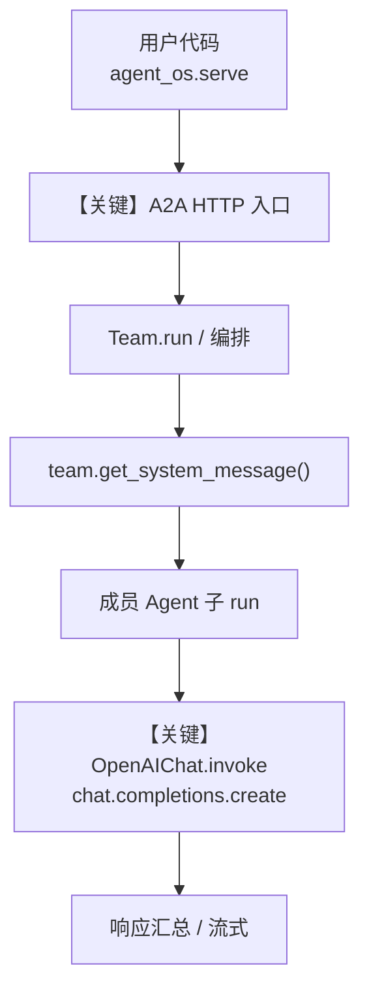

# research_team.py — 实现原理分析

<!-- cookbook-py-source:start -->
## 完整源码

```python
"""
Research Team
=============

Demonstrates research team.
"""

from agno.agent.agent import Agent
from agno.models.openai import OpenAIChat
from agno.os.app import AgentOS
from agno.team.team import Team
from agno.tools.websearch import WebSearchTools

# ---------------------------------------------------------------------------
# Create Example
# ---------------------------------------------------------------------------

researcher = Agent(
    name="researcher",
    id="researcher",
    role="Research Assistant",
    model=OpenAIChat(id="gpt-4o"),
    instructions="You are a research assistant. Find information and provide detailed analysis.",
    tools=[WebSearchTools()],
    markdown=True,
)

writer = Agent(
    name="writer",
    id="writer",
    role="Content Writer",
    model=OpenAIChat(id="o4-mini"),
    instructions="You are a content writer. Create well-structured content based on research.",
    tools=[WebSearchTools()],
    markdown=True,
)

research_team = Team(
    members=[researcher, writer],
    id="research_team",
    name="Research Team",
    description="A collaborative research and content creation team combining deep research capabilities with professional writing to deliver comprehensive, well-researched content",
    instructions="""
    You are a research team that helps users with research and content creation.
    First, use the researcher to gather information, then use the writer to create content.
    """,
    show_members_responses=True,
    get_member_information_tool=True,
    add_member_tools_to_context=True,
    add_history_to_context=True,
    debug_mode=True,
)

# Setup our AgentOS app
agent_os = AgentOS(
    teams=[research_team],
    a2a_interface=True,
)
app = agent_os.get_app()


# ---------------------------------------------------------------------------
# Run Example
# ---------------------------------------------------------------------------

if __name__ == "__main__":
    """Run your AgentOS with A2A interface.

    You can run the Agent via A2A protocol:
    POST http://localhost:7777/teamss/{id}/v1/message:send
    For streaming responses:
    POST http://localhost:7777/teams/{id}/v1/message:stream
    Retrieve the agent card at:
    GET  http://localhost:7777/teams/{id}/.well-known/agent-card.json

    """
    agent_os.serve(app="research_team:app", reload=True, port=7777)
```

<!-- cookbook-py-source:end -->

> 源文件：`cookbook/05_agent_os/interfaces/a2a/research_team.py`

## 概述

本示例展示 Agno 的 **AgentOS + A2A + Team 多智能体协作** 机制：通过 `AgentOS` 暴露带 A2A 协议的 HTTP 服务，由 **Team** 作为编排层协调 `researcher` 与 `writer` 两个 Agent，结合联网搜索与写作分工完成「调研 + 成稿」类任务。

**核心配置一览：**

| 配置项 | 值 | 说明 |
|--------|------|------|
| `researcher` | `Agent(...)` | 调研 Agent：`gpt-4o` + `WebSearchTools` |
| `writer` | `Agent(...)` | 写作 Agent：`o4-mini` + `WebSearchTools` |
| `research_team` | `Team(...)` | 团队编排：`coordinate` 模式（默认）、成员工具进上下文、历史进上下文 |
| `agent_os` | `AgentOS(teams=[research_team], a2a_interface=True)` | 启用 A2A 接口 |
| `model`（Team 显式） | 未在构造函数中传入 | 运行期经 `initialize_team` → `_set_default_model` 设为 `OpenAIChat(id="gpt-4o")`；成员各自保留显式 `model` |
| `db` | `None` | 未设置 |
| `a2a_interface` | `True` | 暴露 A2A 消息端点与 agent card |

## 架构分层

```
用户代码层                agno.team / agno.os 层
┌──────────────────┐    ┌──────────────────────────────────┐
│ research_team.py │    │ AgentOS.get_app()                │
│ Team + 2 Agents  │───>│  Team.run / arun                 │
│ A2A serve :7777  │    │   ├ team/_messages.get_system_  │
│                  │    │   │   message() — Team 系统提示    │
│                  │    │   ├ 成员 Agent 子调用              │
│                  │    │   └ OpenAIChat.invoke (Chat API)   │
└──────────────────┘    └──────────────────────────────────┘
                                │
                                ▼
                        ┌──────────────┐
                        │ OpenAIChat   │
                        │ gpt-4o / o4  │
                        └──────────────┘
```

## 核心组件解析

### Team 与成员 Agent

`Team` 在 `libs/agno/agno/team/_init.py` 的 `initialize_team()` 中会调用 `_set_default_model()`：若 `team.model is None`，则设为 `OpenAIChat(id="gpt-4o")`（约 L524-L539）。成员在 `_initialize_member()` 中若已有 `model` 则不会覆盖（约 L482-485）。

### AgentOS 与 A2A

`AgentOS(teams=[research_team], a2a_interface=True)` 将 Team 注册到 OS，HTTP 层提供 A2A 风格路径（示例注释中的 `POST .../teams/{id}/v1/message:send` 等）。

### 运行机制与因果链

1. **数据路径**：客户端 A2A 请求 → AgentOS 路由到 `research_team` → Team 编排循环 → 按需调用成员 Agent → 各成员 `OpenAIChat.invoke` → `chat.completions.create`。
2. **状态与副作用**：本示例未配置 `db`；`add_history_to_context=True` 在挂载会话存储时会影响上下文；`debug_mode=True` 增加日志，不改变持久化语义。
3. **关键分支**：`show_members_responses=True` 时成员回复对用户/编排可见性增强；`get_member_information_tool=True` 与 `add_member_tools_to_context=True` 使队长可查询成员能力并把成员工具纳入上下文。
4. **与相邻示例差异**：相对同目录 `structured_output.py`（单 Agent + `output_schema`），本文件强调 **多角色 Team + A2A 服务形态**。

## System Prompt 组装

本示例存在 **两类** 系统消息来源：**Team 队长**（`agno/team/_messages.py` 的 `get_system_message()`，约 L328 起）与各 **成员 Agent**（`agno/agent/_messages.py` 的 `get_system_message()`，约 L106 起）。

### Team 队长（协调模型）

| 序号 | 组成部分 | 本文件中的值/来源 | 是否生效 |
|------|---------|-----------------|---------|
| 1 | `system_message` 早退 | `None` | 否，走默认拼装 |
| 2 | `build_context` | 默认 `True` | 是 |
| 3 | `_build_team_context` | 成员列表、协作说明等（团队开场） | 是 |
| 4 | `description` | 长字符串（协作调研与写作） | 是 |
| 5 | `instructions` | 多行字符串（先 researcher 再 writer） | 是 |
| 6 | `markdown` | `False`（未设置，默认） | 否 |
| 7 | 成员各自 `instructions` / `role` | 在成员子轮次中由 Agent 路径拼装 | 成员 run 时生效 |

### 拼装顺序与源码锚点（Team）

默认路径：`team/_messages.py` 中先 `# 1.1` 指令列表 → `# 1.2` 模型附加指令 → `# 1.3` 附加信息 → `# 2.1` `_build_team_context` → `# 2.2` `_build_identity_sections`（约 L454-L460）等。

### 还原后的完整 System 文本（Team 侧可静态还原部分）

```text
<以下由 description 与 instructions 等组成；团队开场段由 _build_team_context 动态追加成员信息，运行时依赖具体成员注册内容，此处列出 cookbook 字面量>

A collaborative research and content creation team combining deep research capabilities with professional writing to deliver comprehensive, well-researched content

    You are a research team that helps users with research and content creation.
    First, use the researcher to gather information, then use the writer to create content.
```

成员 researcher 的 instructions（静态）：

```text
You are a research assistant. Find information and provide detailed analysis.
```

成员 writer 的 instructions（静态）：

```text
You are a content writer. Create well-structured content based on research.
```

### 段落释义（模型视角）

- Team 层指令约束队长按「先调研后写作」分配子任务。
- `description` 界定团队价值与能力边界。
- 成员层各自强化检索深度与文稿结构；工具列表含 `WebSearchTools` 时，模型侧还会收到工具使用相关说明（经 `get_instructions_for_model` 等拼接）。

### 与 User / Developer 消息的边界

用户消息经 A2A 进入 Team run；队长与成员的 user/assistant 历史由 Team/Agent 运行时组包。`OpenAIChat` 默认将 `system` 映射为 API 中的 `developer`（见 `OpenAIChat.default_role_map`，`chat.py` 约 L94-L100）。

## 完整 API 请求

队长与各成员均走 **Chat Completions**（`OpenAIChat.invoke`，`chat.completions.create`，见 `libs/agno/agno/models/openai/chat.py` 约 L412-L417）。

```python
# 典型一次成员 Agent 调用（概念等价）
client.chat.completions.create(
    model="gpt-4o",  # 或成员上的 o4-mini
    messages=[
        # role 经 _format_message 映射，system 常为 "developer"
        {"role": "developer", "content": "<get_system_message 拼装结果>"},
        {"role": "user", "content": "<用户或队长转述的任务>"},
    ],
    tools=[...],  # 含 WebSearchTools 定义时
    **request_params,
)
```

> 与第 5 节关系：`content` 与「还原后的 System 文本」对应；多轮中再附加 assistant/tool 消息。

## Mermaid 流程图



- **【关键】A2A HTTP 入口**：本示例相对普通脚本多出的对外协议面。
- **【关键】OpenAIChat.invoke**：所有子任务最终落到 Chat Completions。

## 关键源码文件索引

| 文件 | 关键函数/类 | 作用 |
|------|------------|------|
| `agno/team/_messages.py` | `get_system_message()` L328+ | Team 系统消息 |
| `agno/team/_init.py` | `_set_default_model()` L524+ | Team 默认 `gpt-4o` |
| `agno/agent/_messages.py` | `get_system_message()` L106+ | 成员 Agent 系统消息 |
| `agno/models/openai/chat.py` | `invoke()` L385+ | Chat Completions 调用 |
| `agno/os/` | `AgentOS` | OS 与应用组装 |
