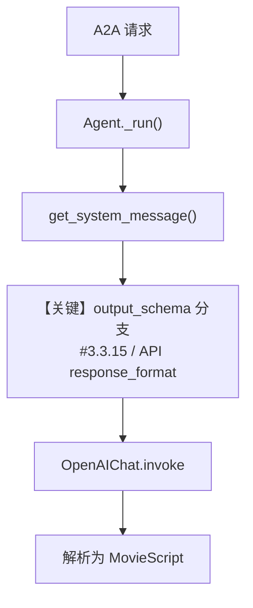

# structured_output.py — 实现原理分析

> 源文件：`cookbook/05_agent_os/interfaces/a2a/structured_output.py`

## 概述

本示例展示 Agno 的 **`output_schema` 结构化输出 + AgentOS A2A** 机制：用 Pydantic 模型 `MovieScript` 约束 LLM 输出字段，经 `OpenAIChat`（支持原生结构化输出）在请求中携带 `response_format`，便于下游消费固定 JSON 形态的电影剧本数据。

**核心配置一览：**

| 配置项 | 值 | 说明 |
|--------|------|------|
| `name` | `"structured-output-agent"` | Agent 名称 |
| `id` | `"structured_output_agent"` | 稳定 ID（A2A 路径用） |
| `model` | `OpenAIChat(id="gpt-4o")` | Chat Completions API |
| `description` | 长字符串（创意编剧角色） | 进入默认 system 拼装 |
| `markdown` | `True` | 与 `output_schema` 同时存在时，默认不追加「Use markdown」句（见 `_messages.py` `# 3.2.1` 条件 `output_schema is None`） |
| `output_schema` | `MovieScript` | Pydantic，结构化输出 |
| `instructions` | `None` | 未设置 |
| `tools` | `None` | 未设置 |
| `agent_os` | `AgentOS(agents=[...], a2a_interface=True)` | A2A |

## 架构分层

```
用户代码层                agno.agent 层
┌──────────────────┐    ┌──────────────────────────────────┐
│ structured_      │    │ Agent._run()                     │
│ output.py        │───>│  get_system_message()            │
│ output_schema=   │    │   # 3.3.1 description            │
│ MovieScript      │    │   # 3.3.15 条件性 JSON 提示       │
│                  │    │  get_run_messages()              │
└──────────────────┘    └──────────────────────────────────┘
                                │
                                ▼
                        ┌──────────────┐
                        │ OpenAIChat   │
                        │ gpt-4o +     │
                        │ response_format│
                        └──────────────┘
```

## 核心组件解析

### `MovieScript` 与 `output_schema`

`MovieScript` 定义字段与 `Field(description=...)`，供模型理解各槽位语义。运行期 `output_schema` 传入 `RunContext`，`get_system_message()` 在 `# 3.3.15`（`agno/agent/_messages.py` 约 L425-435）判断是否追加 `get_json_output_prompt`：对 **支持原生结构化输出** 且未强制 JSON 模式的模型，可能**不**拼接大块 JSON 说明，而主要依赖 API `response_format`。

### 运行机制与因果链

1. **数据路径**：A2A 用户消息 → Agent `run` → 组装含 `MovieScript` 的请求参数 → `OpenAIChat.invoke(..., response_format=MovieScript)` → 解析为结构化内容。
2. **状态与副作用**：无 `db`；无 session 持久化配置。
3. **关键分支**：`markdown=True` 但 `output_schema` 非空 → **跳过**「Use markdown to format your answers.」附加句（L184-185）。
4. **与相邻示例差异**：同目录 `research_team.py` 面向 **Team**；本文件聚焦 **单 Agent + Pydantic 输出 + A2A**。

## System Prompt 组装

| 序号 | 组成部分 | 本文件中的值/来源 | 是否生效 |
|------|---------|-----------------|---------|
| 1 | `description` | 英文长描述（screenwriter） | 是 |
| 2 | `role` | `None` | 否 |
| 3 | `instructions` | `None` | 否 |
| 4 | `markdown` 附加句 | 因 `output_schema` 存在，不追加 markdown 提示 | 否 |
| 5 | `# 3.3.15` JSON prompt | 视模型能力与 `use_json_mode` 等决定是否追加 | 视运行参数 |
| 6 | 模型 `get_system_message_for_model` | 默认可能有工具/安全相关句；本示例无 tools | 依模型实现 |

### 拼装顺序与源码锚点

走默认 `get_system_message()`：`# 3.1` 指令 → `# 3.3.1` description → `# 3.3.3` instructions（空）→ `# 3.3.14` model 段 → `# 3.3.15` JSON（条件），见 `agno/agent/_messages.py`。

### 还原后的完整 System 文本

```text
A creative AI screenwriter that generates detailed, well-structured movie scripts with compelling settings, characters, storylines, and complete plot arcs in a standardized format
```

（若运行时追加了 `# 3.3.15` 的 JSON 说明或模型自定义段，需断点查看 `message.content` 或打印完整 system，本 cookbook 未再写死。）

### 段落释义（模型视角）

- `description` 将模型锁定为「标准化电影剧本」产出。
- 字段级约束主要由 **API `response_format` + Pydantic schema** 保证；自然语言 instructions 本示例未额外提供。

### 与 User / Developer 消息的边界

用户任务来自 A2A POST body；system 承载角色与格式约束；`OpenAIChat` 将 system 映射为 `developer` 角色发送。

## 完整 API 请求

```python
# OpenAIChat.invoke — Chat Completions（libs/agno/agno/models/openai/chat.py L412+）
client.chat.completions.create(
    model="gpt-4o",
    messages=[
        {"role": "developer", "content": "<get_system_message 结果>"},
        {"role": "user", "content": "<用户一条具体请求，示例未写死>"},
    ],
    response_format=<MovieScript 对应的 structured output 参数>,
)
```

> `response_format` 由 `get_request_params` 与 `supports_native_structured_outputs` 等共同决定，与第 5 节 system 文本共同约束最终解析。

## Mermaid 流程图



## 关键源码文件索引

| 文件 | 关键函数/类 | 作用 |
|------|------------|------|
| `agno/agent/_messages.py` | `get_system_message()` L106+；L425-435 | 结构化输出附加逻辑 |
| `agno/models/openai/chat.py` | `invoke()` L385+；`strict_output` 等 | Chat Completions |
| `agno/os/__init__.py` | `AgentOS` | 服务封装 |
