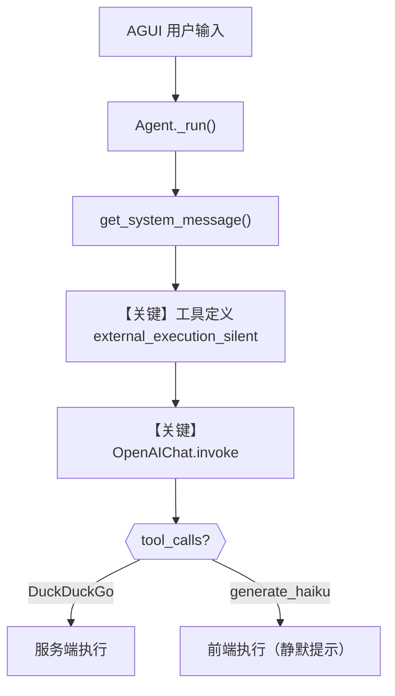

# agent_with_silent_tools.py — 实现原理分析

> 源文件：`cookbook/05_agent_os/interfaces/agui/agent_with_silent_tools.py`

## 概述

本示例展示 Agno 的 **AGUI + 外部执行工具静默模式** 机制：通过 `@tool(external_execution=True, external_execution_silent=True)` 让「前端执行」类工具在 UI 上不刷屏「I have tools to execute...」类提示，同时保留服务端 `DuckDuckGoTools` 搜索，适合生产级 AGUI 体验。

**核心配置一览：**

| 配置项 | 值 | 说明 |
|--------|------|------|
| `model` | `OpenAIChat(id="gpt-4o")` | Chat Completions API |
| `tools` | `[DuckDuckGoTools(), generate_haiku]` | 后端搜索 + 前端 haiku |
| `description` | 长字符串 | 能力概述 |
| `instructions` | 多行（服务端/前端工具分区） | 工具选用策略 |
| `add_datetime_to_context` | `True` | 当前时间进 system |
| `add_history_to_context` | `True` | 历史进上下文 |
| `add_location_to_context` | `True` | 位置进 system |
| `timezone_identifier` | `"Etc/UTC"` | 时区 |
| `markdown` | `True` | 附加 markdown 提示（无 output_schema） |
| `debug_mode` | `True` | 调试日志 |
| `agent_os` | `AgentOS(agents=[agent], interfaces=[AGUI(agent=agent)])` | AGUI 界面 |

## 架构分层

```
用户代码层                agno.agent + agui
┌──────────────────┐    ┌──────────────────────────────────┐
│ agent_with_      │    │ Agent.run → get_system_message() │
│ silent_tools.py  │───>│ 工具：DuckDuckGo + external_exec │
│ AGUI :9001       │    │ AGUI 前端消费 tool_calls         │
└──────────────────┘    └──────────────────────────────────┘
                                │
                                ▼
                        ┌──────────────┐
                        │ OpenAIChat   │
                        └──────────────┘
```

## 核心组件解析

### `@tool(external_execution=True, external_execution_silent=True)`

装饰器将 `generate_haiku` 标为 **前端执行** 且 **静默**，避免默认 external 工具的啰嗦提示（见文件头 docstring）。

### DuckDuckGoTools

服务端真实搜索，与前端工具形成「混合执行面」：模型需在 instructions 中区分两类工具。

### 运行机制与因果链

1. **数据路径**：用户在 AGUI 发消息 → Agent 组消息与 tools → `invoke` → 若模型发起 `generate_haiku` 调用，执行流交给前端；`DuckDuckGo` 在服务端执行。
2. **状态与副作用**：无 `db`；`add_history_to_context` 依赖会话后端若配置则持久化。
3. **关键分支**：`external_execution_silent=True` 与 `False`（见同目录 `agent_with_tools.py`）控制是否输出「将执行外部工具」类提示。
4. **与相邻示例差异**：相对 `agent_with_tools.py` 仅多 `external_execution_silent=True`。

## System Prompt 组装

| 序号 | 组成部分 | 本文件中的值/来源 | 是否生效 |
|------|---------|-----------------|---------|
| 1 | `description` | 英文长描述 | 是 |
| 2 | `instructions` | 多行（Tools / Frontend Tools） | 是 |
| 3 | `markdown` | `True` | 是（`# 3.2.1` 追加 markdown 句） |
| 4 | `add_datetime_to_context` | `True` | 是（`# 3.2.2`） |
| 5 | `add_location_to_context` | `True` | 是（`# 3.2.3`，依赖环境） |
| 6 | `add_name_to_context` | 默认 `False` | 否 |

### 拼装顺序与源码锚点

`agno/agent/_messages.py`：`# 3.3.1` description → `# 3.3.3` instructions → `# 3.3.4` `<additional_information>`（时间/地点等）→ `# 3.3.5` 工具说明。

### 还原后的完整 System 文本（字面量部分）

```text
You are a helpful AI assistant with both backend and frontend capabilities. You can search the web, create beautiful haikus, modify the UI, ask for user confirmations, and create visualizations.

    You are a versatile AI assistant with the following capabilities:

    **Tools (executed on server):**
    - Web search using DuckDuckGo for finding current information

    **Frontend Tools (executed on client):**
    - generate_haiku: Creates a haiku about a given topic

    Always be helpful, creative, and use the most appropriate tool for each request!
```

附加段（时间/地点）为运行时生成，格式见 `# 3.2.2` / `# 3.2.3`；另含 `- Use markdown to format your answers.`（因无 `output_schema`）。

### 段落释义（模型视角）

- 明确 **服务端 vs 客户端** 工具边界，减少错误等待服务端执行前端工具。
- 时间与地点增强时效性与地域相关回答。

## 完整 API 请求

```python
client.chat.completions.create(
    model="gpt-4o",
    messages=[
        {"role": "developer", "content": "<system 拼装>"},
        {"role": "user", "content": "<AGUI 用户输入>"},
    ],
    tools=[...],  # DuckDuckGo + generate_haiku 的 schema
    tool_choice="auto",
)
```

## Mermaid 流程图



## 关键源码文件索引

| 文件 | 关键函数/类 | 作用 |
|------|------------|------|
| `agno/agent/_messages.py` | `get_system_message()` L106+ | system 拼装 |
| `agno/tools/` | `@tool` / `DuckDuckGoTools` | 工具元数据 |
| `agno/os/interfaces/agui` | `AGUI` | 前端协议 |
| `agno/models/openai/chat.py` | `invoke()` L385+ | Chat Completions |
