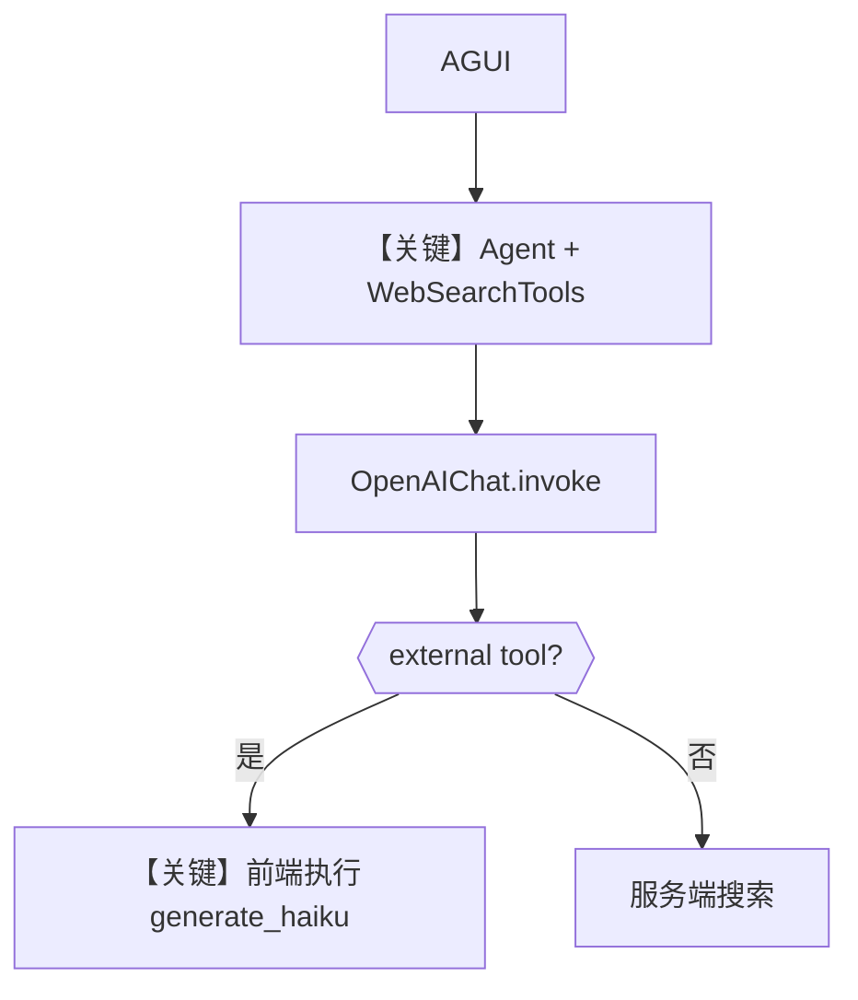

# agent_with_tools.py — 实现原理分析

> 源文件：`cookbook/05_agent_os/interfaces/agui/agent_with_tools.py`

## 概述

本示例展示 Agno 的 **AGUI + 混合工具（服务端 Web 搜索 + 前端 external_execution）** 机制：`WebSearchTools` 在服务端执行，`generate_haiku` 通过 `@tool(external_execution=True)` 将执行交给前端，用于演示 Dojo/AGUI 前后端分工。

**核心配置一览：**

| 配置项 | 值 | 说明 |
|--------|------|------|
| `model` | `OpenAIChat(id="gpt-4o")` | Chat Completions API |
| `tools` | `[WebSearchTools(), generate_haiku]` | 注：`instructions` 文案写 DuckDuckGo，实际为 WebSearchTools，以代码为准 |
| `description` | 长字符串 | 能力描述 |
| `instructions` | 多行 | 工具分区（文案与实现工具名略有出入） |
| `add_datetime_to_context` | `True` | 是 |
| `add_history_to_context` | `True` | 是 |
| `add_location_to_context` | `True` | 是 |
| `timezone_identifier` | `"Etc/UTC"` | 是 |
| `markdown` | `True` | 是 |
| `debug_mode` | `True` | 是 |
| `external_execution_silent` | 未在 `generate_haiku` 上设置 | 默认非静默（与 `agent_with_silent_tools.py` 对比） |

## 架构分层

与 `agent_with_silent_tools.md` 相同分层：**用户代码 → Agent → OpenAIChat**；差异仅在 **external 工具是否静默**。

## 核心组件解析

### `WebSearchTools`

Agno 内置联网搜索工具类（具体提供商由工具实现决定），在服务端执行并返回结果给模型。

### `generate_haiku`（external_execution）

前端渲染俳句；参数含 `english`/`japanese`/`image_names` 列表，返回固定确认串，用于演示 AGUI 展示流。

### 运行机制与因果链

1. **数据路径**：同 silent 版本；工具调用分叉在服务端 vs 客户端。
2. **关键分支**：`external_execution=True` 且 **无** `external_execution_silent=True` 时，用户可能看到额外「将执行外部工具」类提示（行为以框架与前端为准）。
3. **与相邻示例差异**：相对 `agent_with_silent_tools.py` **未**启用静默标志。

## System Prompt 组装

| 组成部分 | 本文件 | 说明 |
|---------|--------|------|
| `description` | 有 | 同 silent 版 |
| `instructions` | 有 | 见下「还原」 |
| `markdown` | 是 | 追加 markdown 提示 |

### 还原后的完整 System 文本（字面量）

```text
You are a helpful AI assistant with both backend and frontend capabilities. You can search the web, create beautiful haikus, modify the UI, ask for user confirmations, and create visualizations.

    You are a versatile AI assistant with the following capabilities:

    **Tools (executed on server):**
    - Web search using DuckDuckGo for finding current information

    Always be helpful, creative, and use the most appropriate tool for each request!
```

运行时另含 `<additional_information>` 中的时间与近似位置；工具 schema 来自 `WebSearchTools` 与 `generate_haiku`。

### 段落释义（模型视角）

- instructions 强调服务端搜索；前端 haiku 仍注册在 tools 列表中，模型可被 schema 驱动调用。

## 完整 API 请求

```python
client.chat.completions.create(
    model="gpt-4o",
    messages=[
        {"role": "developer", "content": "<get_system_message>"},
        {"role": "user", "content": "<用户消息>"},
    ],
    tools=[...],
)
```

## Mermaid 流程图



## 关键源码文件索引

| 文件 | 关键函数/类 | 作用 |
|------|------------|------|
| `agno/agent/_messages.py` | `get_system_message()` | system |
| `agno/tools/websearch` | `WebSearchTools` | 搜索 |
| `agno/models/openai/chat.py` | `invoke()` | API |
