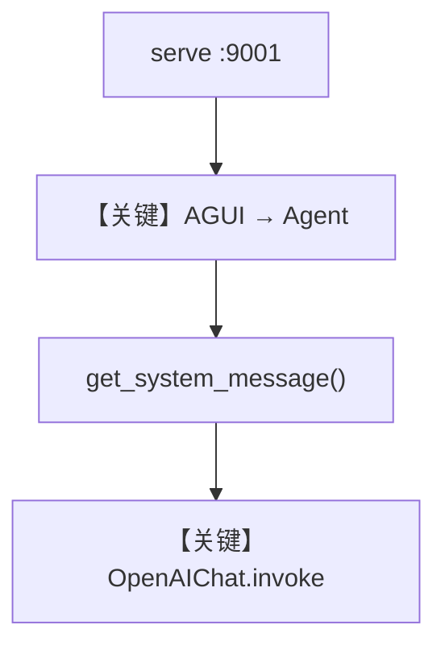

# basic.py — 实现原理分析

<!-- cookbook-py-source:start -->
## 完整源码

```python
"""
Basic
=====

Demonstrates basic.
"""

from agno.agent.agent import Agent
from agno.models.openai import OpenAIChat
from agno.os import AgentOS
from agno.os.interfaces.agui import AGUI

# ---------------------------------------------------------------------------
# Create Example
# ---------------------------------------------------------------------------

chat_agent = Agent(
    name="Assistant",
    model=OpenAIChat(id="gpt-4o"),
    instructions="You are a helpful AI assistant.",
    add_datetime_to_context=True,
    markdown=True,
)

# Setup your AgentOS app
agent_os = AgentOS(
    agents=[chat_agent],
    interfaces=[AGUI(agent=chat_agent)],
)
app = agent_os.get_app()


# ---------------------------------------------------------------------------
# Run Example
# ---------------------------------------------------------------------------

if __name__ == "__main__":
    """Run your AgentOS.

    You can see the configuration and available apps at:
    http://localhost:9001/config

    """
    agent_os.serve(app="basic:app", reload=True, port=9001)
```

<!-- cookbook-py-source:end -->

> 源文件：`cookbook/05_agent_os/interfaces/agui/basic.py`

## 概述

本示例展示 Agno 的 **最小 AgentOS + AGUI** 机制：单 Agent、OpenAI Chat、可选时间与 Markdown，用于验证 Dojo/AGUI 与本地 `serve` 配置页。

**核心配置一览：**

| 配置项 | 值 | 说明 |
|--------|------|------|
| `name` | `"Assistant"` | Agent 名称 |
| `model` | `OpenAIChat(id="gpt-4o")` | Chat Completions API |
| `instructions` | `"You are a helpful AI assistant."` | 短系统指令 |
| `add_datetime_to_context` | `True` | 当前时间 |
| `markdown` | `True` | markdown 提示 |
| `tools` | `None` | 未设置 |
| `description` | `None` | 未设置 |
| `agent_os` | `AgentOS(agents=[chat_agent], interfaces=[AGUI(agent=chat_agent)])` | AGUI |

## 架构分层

```
basic.py  →  Agent.run  →  get_system_message / get_run_messages
         →  OpenAIChat.invoke  →  chat.completions.create
```

## 核心组件解析

### AGUI 接口

`AGUI(agent=chat_agent)` 将同一 Agent 绑定到 AGUI 协议，端口 `9001` 由 `serve` 指定。

### 运行机制与因果链

1. **数据路径**：浏览器/客户端 → AgentOS → Agent → OpenAI。
2. **状态**：无 `db`，无持久历史除非 OS 全局配置。
3. **与相邻示例差异**：无工具、无 Team；最小可运行基线。

## System Prompt 组装

| 序号 | 组成部分 | 本文件 | 是否生效 |
|------|---------|--------|---------|
| 1 | `instructions` | 单行字符串 | 是 |
| 2 | `markdown` | `True` | 是 |
| 3 | `add_datetime_to_context` | `True` | 是 |
| 4 | `description` | `None` | 否 |

### 拼装顺序与源码锚点

`agno/agent/_messages.py`：`# 3.1` instructions → `# 3.3.1` description（跳过）→ `# 3.3.3` instructions → `# 3.3.4` additional_information。

### 还原后的完整 System 文本

```text
You are a helpful AI assistant.

- Use markdown to format your answers.

- The current time is <运行时时间>.
```

（时间串由 `datetime.now(Etc/UTC)` 格式化，见 `# 3.2.2`。）

### 段落释义（模型视角）

- 极短角色定义；时间与 markdown 约束提升回答可读性与时效性。

## 完整 API 请求

```python
client.chat.completions.create(
    model="gpt-4o",
    messages=[
        {"role": "developer", "content": "<上节还原 + 可能的模型附加段>"},
        {"role": "user", "content": "<用户输入>"},
    ],
)
```

## Mermaid 流程图



## 关键源码文件索引

| 文件 | 关键函数/类 | 作用 |
|------|------------|------|
| `agno/agent/_messages.py` | `get_system_message()` L106+ | 默认 system |
| `agno/models/openai/chat.py` | `invoke()` L385+ | Chat Completions |
| `agno/os/interfaces/agui` | `AGUI` | UI 接口 |
