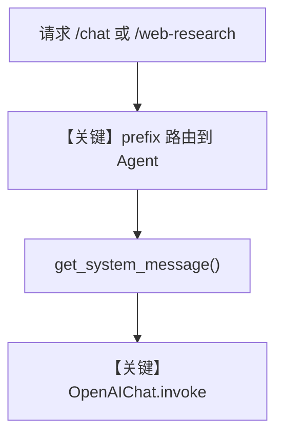

# multiple_instances.py — 实现原理分析

<!-- cookbook-py-source:start -->
## 完整源码

```python
"""
Multiple Instances
==================

Demonstrates multiple instances.
"""

from agno.agent.agent import Agent
from agno.db.sqlite import SqliteDb
from agno.models.openai import OpenAIChat
from agno.os import AgentOS
from agno.os.interfaces.agui import AGUI
from agno.tools.websearch import WebSearchTools

# ---------------------------------------------------------------------------
# Create Example
# ---------------------------------------------------------------------------

db = SqliteDb(db_file="tmp/agentos.db")

chat_agent = Agent(
    name="Assistant",
    model=OpenAIChat(id="gpt-5.2"),
    db=db,
    instructions="You are a helpful AI assistant.",
    add_datetime_to_context=True,
    markdown=True,
)

web_research_agent = Agent(
    name="Web Research Agent",
    model=OpenAIChat(id="gpt-5.2"),
    db=db,
    tools=[WebSearchTools()],
    instructions="You are a helpful AI assistant that can search the web.",
    markdown=True,
)

# Setup your AgentOS app
agent_os = AgentOS(
    agents=[chat_agent, web_research_agent],
    interfaces=[
        AGUI(agent=chat_agent, prefix="/chat"),
        AGUI(agent=web_research_agent, prefix="/web-research"),
    ],
)
app = agent_os.get_app()


# ---------------------------------------------------------------------------
# Run Example
# ---------------------------------------------------------------------------

if __name__ == "__main__":
    """Run your AgentOS.

    You can see the configuration and available apps at:
    http://localhost:7777/config

    """
    agent_os.serve(app="multiple_instances:app", reload=True)
```

<!-- cookbook-py-source:end -->

> 源文件：`cookbook/05_agent_os/interfaces/agui/multiple_instances.py`

## 概述

本示例展示 Agno 的 **同一 AgentOS 上多 Agent + 多 AGUI 路由前缀** 机制：两个 Agent 共享 `SqliteDb` 会话存储，通过 `AGUI(..., prefix=...)` 将 `/chat` 与 `/web-research` 映射到不同助手，便于在一个进程中挂载多种 UI 入口。

**核心配置一览：**

| 配置项 | 值 | 说明 |
|--------|------|------|
| `db` | `SqliteDb(db_file="tmp/agentos.db")` | 开发用 SQLite |
| `chat_agent` | `Agent(..., model=gpt-5.2)` | 通用对话 |
| `web_research_agent` | `Agent(..., tools=[WebSearchTools()])` | 联网检索 |
| `agent_os` | 两 Agent + 两 `AGUI` 不同 `prefix` | 多实例路由 |
| `add_datetime_to_context` | `chat_agent` 为 `True` | 仅 chat_agent |
| `markdown` | 两者 `True` | 是 |

## 架构分层

```
multiple_instances.py
  → AgentOS(agents=[...], interfaces=[AGUI×2])
  → 各 Agent 独立 run，共享 db 适配器
  → OpenAIChat.invoke
```

## 核心组件解析

### 共享 `SqliteDb`

两 Agent 使用同一 `db` 实例，在启用 `user_id`/`session` 等时可在同库区分会话（本示例未显式设置 `user_id`）。

### `AGUI` 的 `prefix`

`/chat` 与 `/web-research` 将 AGUI HTTP/WebSocket 面拆到不同路径，避免单一路由冲突。

### 运行机制与因果链

1. **数据路径**：客户端按 prefix 命中不同 Agent → 各自 `get_run_messages` → 同一 OpenAI 模型 ID。
2. **状态**：SQLite 可持久化运行记录（依 AgentOS/Agent 存储策略）。
3. **与 basic 差异**：**多 Agent + 前缀路由 + 共享 db**。

## System Prompt 组装

### chat_agent

| 组成部分 | 值 |
|---------|-----|
| `instructions` | `"You are a helpful AI assistant."` |
| `markdown` | 是 |
| `add_datetime_to_context` | 是 |

### web_research_agent

| 组成部分 | 值 |
|---------|-----|
| `instructions` | `"You are a helpful AI assistant that can search the web."` |
| `tools` | `WebSearchTools()` → 工具说明进入 system（`# 3.3.5` 等） |

### 还原后的完整 System 文本（chat_agent 字面量核心）

```text
You are a helpful AI assistant.

- Use markdown to format your answers.

- The current time is <运行时>.
```

web_research_agent 无 `add_datetime_to_context`，故无时间行 unless model adds.

## 完整 API 请求

```python
client.chat.completions.create(
    model="gpt-5.2",
    messages=[{"role": "developer", "content": "<system>"}, {"role": "user", "content": "..."}],
    tools=None,  # chat_agent
)
# web_research_agent 带 tools=[...]
```

## Mermaid 流程图



## 关键源码文件索引

| 文件 | 关键函数/类 | 作用 |
|------|------------|------|
| `agno/db/sqlite.py` | `SqliteDb` | 会话存储 |
| `agno/os/interfaces/agui` | `AGUI(prefix=...)` | 多实例 |
| `agno/agent/_messages.py` | `get_system_message()` | system |
