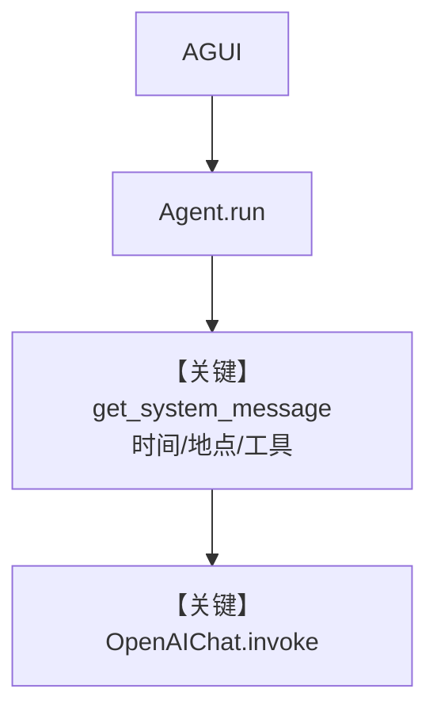

# reasoning_agent.py — 实现原理分析

<!-- cookbook-py-source:start -->
## 完整源码

```python
"""
Reasoning Agent
===============

Demonstrates reasoning agent.
"""

from agno.agent.agent import Agent
from agno.models.openai import OpenAIChat
from agno.os import AgentOS
from agno.os.interfaces.agui import AGUI
from agno.tools.websearch import WebSearchTools

# ---------------------------------------------------------------------------
# Create Example
# ---------------------------------------------------------------------------

chat_agent = Agent(
    name="Assistant",
    model=OpenAIChat(id="o4-mini"),
    instructions="You are a helpful AI assistant.",
    add_datetime_to_context=True,
    add_history_to_context=True,
    add_location_to_context=True,
    timezone_identifier="Etc/UTC",
    markdown=True,
    tools=[WebSearchTools()],
)

# Setup your AgentOS app
agent_os = AgentOS(
    agents=[chat_agent],
    interfaces=[AGUI(agent=chat_agent)],
)
app = agent_os.get_app()


# ---------------------------------------------------------------------------
# Run Example
# ---------------------------------------------------------------------------

if __name__ == "__main__":
    """Run your AgentOS.

    You can see the configuration and available apps at:
    http://localhost:9001/config

    """
    agent_os.serve(app="reasoning_agent:app", reload=True, port=9001)
```

<!-- cookbook-py-source:end -->

> 源文件：`cookbook/05_agent_os/interfaces/agui/reasoning_agent.py`

## 概述

本示例展示 Agno 的 **AGUI + 推理向模型（o4-mini）+ 联网工具** 机制：文件名含 reasoning，实质为单 Agent 配 `WebSearchTools` 与较丰富上下文（时间、历史、位置），用于在 AGUI 上做可检索的助手演示。

**核心配置一览：**

| 配置项 | 值 | 说明 |
|--------|------|------|
| `name` | `"Assistant"` | 名称 |
| `model` | `OpenAIChat(id="o4-mini")` | Chat Completions API |
| `instructions` | `"You are a helpful AI assistant."` | 短指令 |
| `tools` | `[WebSearchTools()]` | 联网 |
| `add_datetime_to_context` | `True` | 是 |
| `add_history_to_context` | `True` | 是 |
| `add_location_to_context` | `True` | 是 |
| `timezone_identifier` | `"Etc/UTC"` | 是 |
| `markdown` | `True` | 是 |

## 架构分层

与 `basic.py` 相同，多 **tools** 与 **history/location** 附加段。

## 核心组件解析

### `o4-mini`

作为 `OpenAIChat` 的 `id` 传入，走同一 `invoke` → `chat.completions.create` 路径。

### 运行机制与因果链

1. **数据路径**：用户消息 + 可选历史 → system 含时间/地点 → 模型可发起搜索工具调用。
2. **与相邻示例差异**：比 `basic.py` 多 **工具 + 历史 + 位置**；文件名强调推理/搜索场景。

## System Prompt 组装

| 组成部分 | 是否生效 |
|---------|---------|
| `instructions` | 是 |
| `markdown` 提示 | 是 |
| `add_datetime_to_context` | 是 |
| `add_location_to_context` | 是（有则写入） |
| 工具说明 | 是 |

### 还原后的完整 System 文本（固定字面量）

```text
You are a helpful AI assistant.
```

并附加 `<additional_information>`：markdown 句、当前时间、近似位置；以及工具相关段（来自 `get_instructions_for_model` / `_tool_instructions`）。

## 完整 API 请求

```python
client.chat.completions.create(
    model="o4-mini",
    messages=[...],
    tools=[...],  # WebSearchTools schema
)
```

## Mermaid 流程图



## 关键源码文件索引

| 文件 | 关键函数/类 | 作用 |
|------|------------|------|
| `agno/agent/_messages.py` | `get_system_message()` | 拼装 |
| `agno/models/openai/chat.py` | `invoke()` | API |
