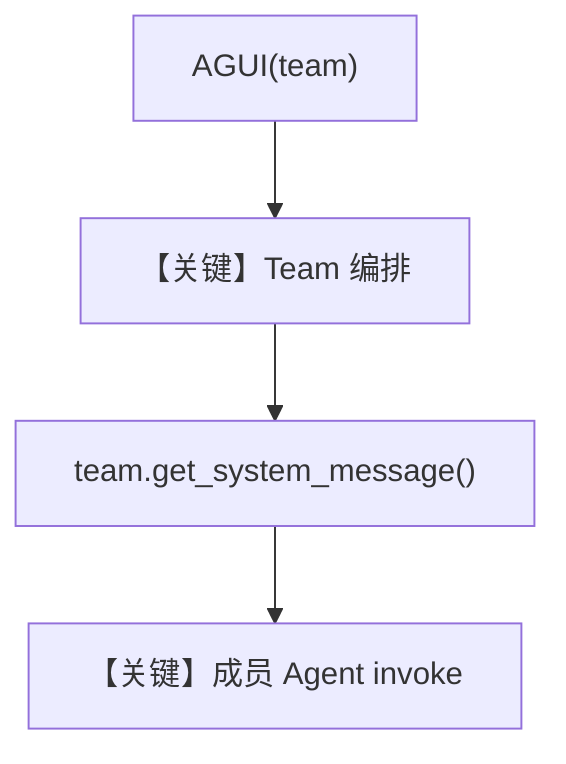

# research_team.py — 实现原理分析

<!-- cookbook-py-source:start -->
## 完整源码

```python
"""
Research Team
=============

Demonstrates research team.
"""

from agno.agent.agent import Agent
from agno.models.openai import OpenAIChat
from agno.os.app import AgentOS
from agno.os.interfaces.agui.agui import AGUI
from agno.team.team import Team
from agno.tools.websearch import WebSearchTools

# ---------------------------------------------------------------------------
# Create Example
# ---------------------------------------------------------------------------

researcher = Agent(
    name="researcher",
    role="Research Assistant",
    model=OpenAIChat(id="gpt-4o"),
    instructions="You are a research assistant. Find information and provide detailed analysis.",
    tools=[WebSearchTools()],
    markdown=True,
)

writer = Agent(
    name="writer",
    role="Content Writer",
    model=OpenAIChat(id="o4-mini"),
    instructions="You are a content writer. Create well-structured content based on research.",
    tools=[WebSearchTools()],
    markdown=True,
)

research_team = Team(
    members=[researcher, writer],
    name="research_team",
    instructions="""
    You are a research team that helps users with research and content creation.
    First, use the researcher to gather information, then use the writer to create content.
    """,
    show_members_responses=True,
    get_member_information_tool=True,
    add_member_tools_to_context=True,
    add_history_to_context=True,
)

# Setup our AgentOS app
agent_os = AgentOS(
    teams=[research_team],
    interfaces=[AGUI(team=research_team)],
)
app = agent_os.get_app()


# ---------------------------------------------------------------------------
# Run Example
# ---------------------------------------------------------------------------

if __name__ == "__main__":
    """Run your AgentOS.

    You can see the configuration and available apps at:
    http://localhost:9001/config
    
    Use Port 9001 for Dojo compatibility.
    """
    agent_os.serve(app="research_team:app", reload=True, port=9001)
```

<!-- cookbook-py-source:end -->

> 源文件：`cookbook/05_agent_os/interfaces/agui/research_team.py`

## 概述

本示例展示 Agno 的 **AgentOS + AGUI + Team** 机制：与 A2A 版 `interfaces/a2a/research_team.py` 同构的双成员团队（researcher + writer），但对外通过 `AGUI(team=research_team)` 暴露 **AGUI** 而非 A2A，用于 Dojo/可视化协作演示。

**核心配置一览：**

| 配置项 | 值 | 说明 |
|--------|------|------|
| `researcher` | `OpenAIChat(gpt-4o)` + `WebSearchTools` | 调研 |
| `writer` | `OpenAIChat(o4-mini)` + `WebSearchTools` | 写作 |
| `research_team` | `Team(members=..., name=..., instructions=...)` | 无显式 `id`/`description`（与 a2a 版不同） |
| `show_members_responses` | `True` | 是 |
| `get_member_information_tool` | `True` | 是 |
| `add_member_tools_to_context` | `True` | 是 |
| `add_history_to_context` | `True` | 是 |
| `agent_os` | `AgentOS(teams=[...], interfaces=[AGUI(team=...)])` | AGUI |
| `Team.model` | 未传入 | 初始化后默认 `OpenAIChat(gpt-4o)` |

## 架构分层

```
AGUI → AgentOS → Team.run → team/_messages.get_system_message
     → 成员子 Agent runs → OpenAIChat.invoke
```

## 核心组件解析

### `AGUI(team=research_team)`

将 **Team** 而非单个 Agent 绑定到 AGUI，前端与队长交互，底层再调度成员。

### 运行机制与因果链

1. **数据路径**：AGUI 用户输入 → Team 编排 → 成员按需调用。
2. **与 a2a/research_team.py 差异**：**接口**为 AGUI；本文件 **无** `id="research_team"`、`description`、**无** `a2a_interface=True`。

## System Prompt 组装

Team 层 `get_system_message()`（`agno/team/_messages.py` L328+）包含 `_build_team_context` 与 `instructions`：

### 还原后的完整 System 文本（字面量）

```text
    You are a research team that helps users with research and content creation.
    First, use the researcher to gather information, then use the writer to create content.
```

成员静态 instructions：

```text
You are a research assistant. Find information and provide detailed analysis.
```

```text
You are a content writer. Create well-structured content based on research.
```

另含动态「成员列表/模式」等由 `_build_team_context` 生成，需运行时查看完整 content。

## 完整 API 请求

队长与成员均经 `OpenAIChat.invoke` / `chat.completions.create`；消息角色映射见 `OpenAIChat.default_role_map`。

## Mermaid 流程图



## 关键源码文件索引

| 文件 | 关键函数/类 | 作用 |
|------|------------|------|
| `agno/team/_messages.py` | `get_system_message()` L328+ | Team system |
| `agno/os/interfaces/agui` | `AGUI(team=...)` | Team 绑定 UI |
