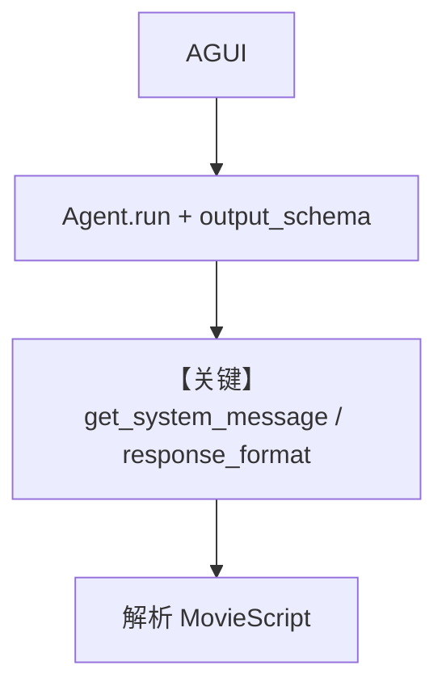

# structured_output.py — 实现原理分析

<!-- cookbook-py-source:start -->
## 完整源码

```python
"""
Structured Output
=================

Demonstrates structured output.
"""

from typing import List

from agno.agent.agent import Agent
from agno.models.openai import OpenAIChat
from agno.os import AgentOS
from agno.os.interfaces.agui import AGUI
from pydantic import BaseModel, Field

# ---------------------------------------------------------------------------
# Create Example
# ---------------------------------------------------------------------------


class MovieScript(BaseModel):
    setting: str = Field(
        ..., description="Provide a nice setting for a blockbuster movie."
    )
    ending: str = Field(
        ...,
        description="Ending of the movie. If not available, provide a happy ending.",
    )
    genre: str = Field(
        ...,
        description="Genre of the movie. If not available, select action, thriller or romantic comedy.",
    )
    name: str = Field(..., description="Give a name to this movie")
    characters: List[str] = Field(..., description="Name of characters for this movie.")
    storyline: str = Field(
        ..., description="3 sentence storyline for the movie. Make it exciting!"
    )


chat_agent = Agent(
    name="Output Schema Agent",
    model=OpenAIChat(id="gpt-4o"),
    description="You write movie scripts.",
    markdown=True,
    output_schema=MovieScript,
)


# Setup your AgentOS app
agent_os = AgentOS(
    agents=[chat_agent],
    interfaces=[AGUI(agent=chat_agent)],
)
app = agent_os.get_app()

# ---------------------------------------------------------------------------
# Run Example
# ---------------------------------------------------------------------------

if __name__ == "__main__":
    """Run your AgentOS.

    You can see the configuration and available apps at:
    http://localhost:9001/config

    """

    agent_os.serve(app="structured_output:app", port=9001, reload=True)
```

<!-- cookbook-py-source:end -->

> 源文件：`cookbook/05_agent_os/interfaces/agui/structured_output.py`

## 概述

本示例展示 Agno 的 **AGUI + `output_schema`（MovieScript）** 机制：相对 A2A 同主题示例，本文件将 `description` 缩短为「You write movie scripts.」，仍用 `OpenAIChat(gpt-4o)` 与 Pydantic 约束输出，供 AGUI 消费结构化字段。

**核心配置一览：**

| 配置项 | 值 | 说明 |
|--------|------|------|
| `name` | `"Output Schema Agent"` | 名称 |
| `model` | `OpenAIChat(id="gpt-4o")` | Chat Completions |
| `description` | `"You write movie scripts."` | 短描述 |
| `markdown` | `True` | 与 `output_schema` 并存时不追加「Use markdown」句 |
| `output_schema` | `MovieScript` | Pydantic |
| `instructions` | `None` | 未设置 |
| `interfaces` | `AGUI(agent=chat_agent)` | AGUI |

## 核心组件解析

与 `interfaces/a2a/structured_output.py` 共享同一 `MovieScript` 形态；差异在 **OS 接口（AGUI vs A2A）** 与 **description 长度**。

### 运行机制与因果链

结构化输出路径：`output_schema` → `RunContext` → `get_system_message` 中 `# 3.3.15` 条件逻辑 + `invoke` 时 `response_format`。

## System Prompt 组装

### 还原后的完整 System 文本（静态）

```text
You write movie scripts.
```

无独立 `instructions`；若模型支持原生结构化输出，大段 JSON 说明可能由 API 层处理而非拼进纯文本 system。

## 完整 API 请求

```python
client.chat.completions.create(
    model="gpt-4o",
    messages=[...],
    response_format=<MovieScript>,
)
```

## Mermaid 流程图



## 关键源码文件索引

| 文件 | 关键函数/类 | 作用 |
|------|------------|------|
| `agno/agent/_messages.py` | `get_system_message()` | 含 `# 3.3.15` |
| `agno/models/openai/chat.py` | `invoke()` | 结构化输出 |
