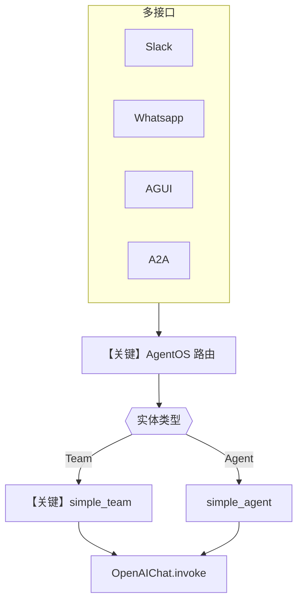

# all_interfaces.py — 实现原理分析

<!-- cookbook-py-source:start -->
## 完整源码

```python
"""
AgentOS Demo

Prerequisites:
uv pip install -U fastapi uvicorn sqlalchemy pgvector psycopg openai ddgs yfinance
"""

from agno import __version__ as agno_version
from agno.agent import Agent
from agno.db.postgres import PostgresDb
from agno.knowledge.knowledge import Knowledge
from agno.models.openai import OpenAIChat
from agno.os import AgentOS
from agno.os.interfaces.a2a import A2A
from agno.os.interfaces.agui import AGUI
from agno.os.interfaces.slack import Slack
from agno.os.interfaces.whatsapp import Whatsapp
from agno.registry import Registry
from agno.team import Team
from agno.tools.mcp import MCPTools
from agno.vectordb.pgvector import PgVector
from agno.workflow import Workflow
from agno.workflow.step import Step

# ---------------------------------------------------------------------------
# Create Example
# ---------------------------------------------------------------------------

# Database connection
db_url = "postgresql+psycopg://ai:ai@localhost:5532/ai"

# Create Postgres-backed memory store
db = PostgresDb(db_url=db_url)

# Create Postgres-backed vector store
vector_db = PgVector(
    db_url=db_url,
    table_name="agno_docs",
)
knowledge = Knowledge(
    name="Agno Docs",
    contents_db=db,
    vector_db=vector_db,
)

registry = Registry(
    name="Agno Registry",
    tools=[MCPTools(transport="streamable-http", url="https://docs.agno.com/mcp")],
    models=[
        OpenAIChat(id="gpt-5"),
    ],
    dbs=[db],
)

# Create an agent
simple_agent = Agent(
    name="Simple Agent",
    role="Simple agent",
    id="simple-agent",
    model=OpenAIChat(id="gpt-5.2"),
    instructions=["You are a simple agent"],
    knowledge=knowledge,
)

# Create a team
simple_team = Team(
    name="Simple Team",
    description="A team of agents",
    members=[simple_agent],
    model=OpenAIChat(id="gpt-5.2"),
    id="simple-team",
    instructions=[
        "You are the team lead.",
    ],
    db=db,
    markdown=True,
)

# Create a workflow
simple_workflow = Workflow(
    name="Simple Workflow",
    description="A simple workflow",
    steps=[
        Step(agent=simple_team),
    ],
)

# Create an interface
slack_interface = Slack(agent=simple_team)
whatsapp_interface = Whatsapp(agent=simple_agent)
agui_interface = AGUI(agent=simple_agent)
a2a_interface = A2A(agents=[simple_agent])


# Create the AgentOS
agent_os = AgentOS(
    id="agentos-demo",
    name="Agno API Reference",
    version=agno_version,
    description="The all-in-one, private, secure agent platform that runs in your cloud.",
    agents=[simple_agent],
    teams=[simple_team],
    workflows=[simple_workflow],
    interfaces=[slack_interface, whatsapp_interface, agui_interface, a2a_interface],
    registry=registry,
    db=db,
)
app = agent_os.get_app()


# ---------------------------------------------------------------------------
# Run Example
# ---------------------------------------------------------------------------

if __name__ == "__main__":
    agent_os.serve(app="all_interfaces:app", port=7777)
```

<!-- cookbook-py-source:end -->

> 源文件：`cookbook/05_agent_os/interfaces/all_interfaces.py`

## 概述

本示例展示 Agno 的 **AgentOS 聚合：Postgres + PgVector 知识库 + Registry(MCP) + 多通道接口（Slack / WhatsApp / AGUI / A2A）+ Team + Workflow** 机制，作为「全接口」演示入口，强调生产向 **Postgres** 与 **Registry** 统一注册模型与工具。

**核心配置一览：**

| 配置项 | 值 | 说明 |
|--------|------|------|
| `db` | `PostgresDb(db_url=...)` | 生产向 DB |
| `vector_db` / `knowledge` | `PgVector` + `Knowledge` | RAG |
| `registry` | `Registry(tools=[MCPTools(...)], models=[OpenAIChat], dbs=[db])` | 注册表 |
| `simple_agent` | `Agent(knowledge=knowledge, ...)` | 简单 Agent |
| `simple_team` | `Team(members=[simple_agent], db=db, ...)` | 单成员团队 |
| `simple_workflow` | `Workflow(steps=[Step(agent=simple_team)])` | 一步工作流 |
| `interfaces` | `Slack`, `Whatsapp`, `AGUI`, `A2A` | 四通道 |
| `agent_os` | 含 `agents`, `teams`, `workflows`, `registry`, `db` | 全量 OS |

## 架构分层

```
all_interfaces.py
  → AgentOS 聚合 db/knowledge/registry
  → 各 Interface 适配器将外部事件转为 Agent/Team/Workflow run
  → Model.invoke
```

## 核心组件解析

### Postgres + PgVector

`db_url` 指向本地 Postgres；`Knowledge` 同时挂 `contents_db` 与 `vector_db`，支持检索增强（需 `search_knowledge` 等在 Agent 上启用时才进入 run——本示例 `simple_agent` **未** 设 `search_knowledge=True`，知识库对象已挂载但默认不检索，除非框架对 `knowledge=` 有隐式行为，需以源码为准）。

`Agent` 默认 `search_knowledge=True`（`agno/agent/agent.py`），故挂载 `knowledge` 后会在 system 中按 `_messages.py` 中 `# 3.3.13` 等逻辑加入检索说明（若 `add_search_knowledge_instructions` 为真且知识库 `build_context` 有内容）。

### `Registry` 与 `MCPTools`

`MCPTools(transport="streamable-http", url="https://docs.agno.com/mcp")` 将远程 MCP 工具注册到 Registry，供平台发现。

### 多接口

- `Slack(agent=simple_team)`：团队入口  
- `Whatsapp(agent=simple_agent)`：单 Agent  
- `AGUI(agent=simple_agent)`  
- `A2A(agents=[simple_agent])`

### 运行机制与因果链

1. **数据路径**：外部通道 → 对应 Interface → `AgentOS` 路由 → Agent/Team/Workflow `_run` → `OpenAIChat.invoke`。
2. **状态**：`PostgresDb` 持久化会话与用户数据（依配置）。
3. **关键分支**：不同接口绑定 **Team vs Agent**，行为与 system 内容不同（Team 走 `team/_messages`）。

## System Prompt 组装

本文件含 **多个** 可运行实体：

### `simple_agent`

| 组成部分 | 值 |
|---------|-----|
| `instructions` | `["You are a simple agent"]` |
| `role` | `"Simple agent"` |
| `knowledge` | 已挂载，**未** `search_knowledge=True` |

### `simple_team`

| 组成部分 | 值 |
|---------|-----|
| `description` | `"A team of agents"` |
| `instructions` | `["You are the team lead."]` |
| `markdown` | `True` |

### 还原后的完整 System 文本（Agent 侧字面量）

```text
You are a simple agent
```

（`role` 进入 `<your_role>` 段，见 `_messages.py` `# 3.3.2`。）

Team 侧另含 `_build_team_context` 等动态段。

## 完整 API 请求

```python
# simple_agent / simple_team 最终均到 OpenAIChat
client.chat.completions.create(
    model="gpt-5.2",
    messages=[{"role": "developer", "content": "<system>"}, {"role": "user", "content": "..."}],
)
```

## Mermaid 流程图



## 关键源码文件索引

| 文件 | 关键函数/类 | 作用 |
|------|------------|------|
| `agno/os/__init__.py` | `AgentOS` | 聚合 |
| `agno/os/interfaces/*` | Slack, Whatsapp, AGUI, A2A | 适配器 |
| `agno/registry` | `Registry` | 注册 |
| `agno/knowledge/knowledge.py` | `Knowledge` | 知识 |
