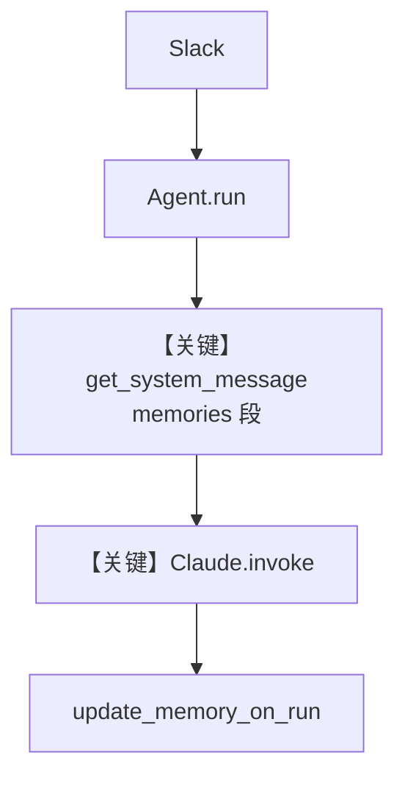

# agent_with_user_memory.py — 实现原理分析

> 源文件：`cookbook/05_agent_os/interfaces/slack/agent_with_user_memory.py`

## 概述

本示例展示 Agno 的 **Slack + MemoryManager + update_memory_on_run** 机制：在 Slack 中维护「个人 AI 朋友」，用 `MemoryManager`（独立 `Claude` 模型）在每次 run 后抽取用户事实，并在后续对话通过 system 中的 memories 段注入上下文。

**核心配置一览：**

| 配置项 | 值 | 说明 |
|--------|------|------|
| `model` | `Claude(id="claude-sonnet-4-20250514")` | Anthropic Messages API |
| `memory_manager` | `MemoryManager(..., model=Claude(...))` | 记忆抽取 |
| `update_memory_on_run` | `True` | 运行后更新记忆 |
| `db` | `SqliteDb(..., tmp/persistent_memory.db)` | 会话持久化 |
| `tools` | `[WebSearchTools()]` | 联网 |
| `add_history_to_context` | `True`，`num_history_runs=3` | 历史 |
| `instructions` | `dedent(...)` 多行 | Slack 场景指令 |
| `interfaces` | `Slack(agent=personal_agent)` | Slack |

## 架构分层

```
Slack 事件 → AgentOS → Agent.run
  → get_system_message（含 memories 段 #3.3.9）
  → Claude.invoke (Messages API)
  → 结束后 MemoryManager 写回事实
```

## 核心组件解析

### `MemoryManager`

`memory_capture_instructions` 定义要抓取的用户信息维度；与 `update_memory_on_run=True` 配合，在 run 后触发记忆管线（具体钩子见 `agno/memory/`）。

### 运行机制与因果链

1. **数据路径**：Slack 消息 → Agent → Claude 主对话；记忆子模型异步/同步处理记忆库。
2. **状态**：SQLite 存 session；MemoryManager 存用户事实。
3. **与 basic 差异**：**持久化用户画像** 与 **联网**。

## System Prompt 组装

| 组成部分 | 本文件 |
|---------|--------|
| `instructions` | dedent 块全文 |
| `add_memories_to_context` | 默认行为与 `update_memory_on_run` 联动（见 Agent 初始化） |
| `# 3.3.9` memories | 有记忆则注入 `<memories_from_previous_interactions>` |

### 还原后的完整 System 文本（instructions 字面量）

```text
You are a personal AI friend in a Slack chat. Your purpose is to chat with the user and make them feel good.
First introduce yourself and ask for their name, then ask about themselves, their hobbies, what they like to do and what they like to talk about.
Use the web search tool to find the latest information about things in the conversation.
You may sometimes receive messages prepended with "group message" — when that happens, reply to the whole group instead of treating them as from a single user.
```

另含时间、markdown、历史与记忆等动态段。

## 完整 API 请求

主 Agent 使用 **Anthropic Messages**（`Claude.invoke`，`libs/agno/agno/models/anthropic/claude.py` 约 L563+），形态为 `messages.create` 风格（以源码为准），非 OpenAI `chat.completions`。

```python
# 概念等价：主对话
# client.messages.create(model="claude-sonnet-4-20250514", system=..., messages=[...], tools=[...])
```

记忆抽取用的第二个 `Claude` 实例同理。

## Mermaid 流程图



## 关键源码文件索引

| 文件 | 关键函数/类 | 作用 |
|------|------------|------|
| `agno/agent/_messages.py` | `# 3.3.9` memories | system 注入 |
| `agno/memory/manager.py` | `MemoryManager` | 记忆 |
| `agno/models/anthropic/claude.py` | `invoke()` | Anthropic API |
