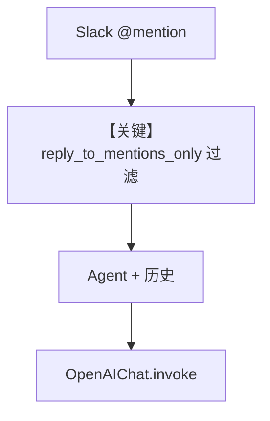

# basic.py — 实现原理分析

> 源文件：`cookbook/05_agent_os/interfaces/slack/basic.py`

## 概述

本示例展示 Agno 的 **Slack 最小机器人 + SQLite 会话 + 仅响应 @提及** 机制：`reply_to_mentions_only=True` 限制只在频道被 @ 时回复，配合 `add_history_to_context` 与 `db` 在重启后仍保留最近几轮上下文。

**核心配置一览：**

| 配置项 | 值 | 说明 |
|--------|------|------|
| `model` | `OpenAIChat(id="gpt-4o")` | Chat Completions |
| `db` | `SqliteDb(session_table="agent_sessions", ...)` | 会话表 |
| `add_history_to_context` | `True`，`num_history_runs=3` | 历史 |
| `add_datetime_to_context` | `True` | 时间 |
| `instructions` | `None` | 未设置 |
| `Slack` | `reply_to_mentions_only=True` | 仅提及 |

## 架构分层

```
Slack @mention → Slack 适配器 → Agent.run → OpenAIChat.invoke
```

## 核心组件解析

### `reply_to_mentions_only`

忽略纯 DM 或未提及消息的行为由 `Slack` 接口实现，减少噪声。

### 运行机制与因果链

1. **数据路径**：提及消息 → 会话 id（通常按 thread/channel 映射）→ 带历史 run。
2. **与 agent_with_user_memory 差异**：无 MemoryManager，无工具。

## System Prompt 组装

未设置 `instructions` 与 `description`；默认 system 主要来自 **模型附加段**、**时间**、**markdown 默认**（若开启）等。

### 还原后的完整 System 文本

无长字面量 instructions；包含 `- The current time is ...`（`# 3.2.2`）及可能的历史摘要结构（由 `get_run_messages` 组装 user/assistant 序列）。

## 完整 API 请求

```python
client.chat.completions.create(
    model="gpt-4o",
    messages=[{"role": "developer", "content": "<system>"}, ...history..., {"role": "user", "content": "..."}],
)
```

## Mermaid 流程图



## 关键源码文件索引

| 文件 | 关键函数/类 | 作用 |
|------|------------|------|
| `agno/os/interfaces/slack` | `Slack` | 提及策略 |
| `agno/models/openai/chat.py` | `invoke()` | API |
