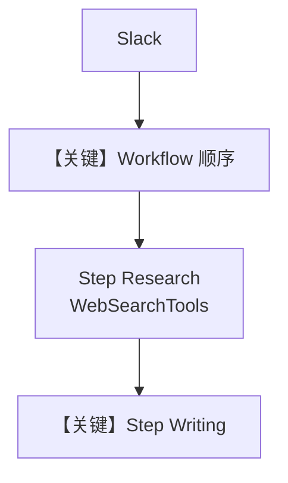

# basic_workflow.py — 实现原理分析

> 源文件：`cookbook/05_agent_os/interfaces/slack/basic_workflow.py`

## 概述

本示例展示 Agno 的 **Slack + Workflow 顺序步骤** 机制：`Workflow` 含 `Research Step`（联网）与 `Writing Step`（成稿），通过 `Slack(workflow=content_workflow)` 将 Slack 消息作为工作流输入，实现「先搜后写」的流水线。

**核心配置一览：**

| 配置项 | 值 | 说明 |
|--------|------|------|
| `researcher_agent` | `gpt-4o-mini` + `WebSearchTools` | 步骤 1 |
| `writer_agent` | `gpt-4o-mini` | 步骤 2 |
| `content_workflow` | `Workflow(db=..., steps=[research, writing])` | 顺序执行 |
| `interfaces` | `Slack(workflow=content_workflow)` | 无单独 `agents=` |
| `db` | `SqliteDb(..., basic_workflow.db)` | 工作流会话 |

## 架构分层

```
Slack → Workflow.run → Step1 Agent → Step2 Agent → 输出回 Slack
```

## 核心组件解析

### `Workflow` 与 `Step`

每步绑定独立 `Agent`，各自 `get_system_message`；步骤间传递上一步输出作为下一步输入（行为见 `agno/workflow/` 实现）。

### 运行机制与因果链

1. **数据路径**：用户主题 → Research 汇总 → Writer 润色。
2. **与 Team 差异**：Workflow 为 **程序固定顺序**；Team 为 **LLM 编排**。

## System Prompt 组装

本示例不存在单一 Agent 覆盖全流程；每步 Agent 各自拼装。

### researcher_agent 字面量

`role` + `instructions` 列表：

```text
Search the web and gather comprehensive research on the given topic
```

```text
- Search for the most recent and relevant information
- Focus on credible sources and key insights
- Summarize findings clearly and concisely
```

### writer_agent 字面量

```text
Create engaging content based on research findings
```

```text
- Write in a clear, engaging, and professional tone
- ...
```

## 完整 API 请求

每步一次 `OpenAIChat.invoke` / `chat.completions.create`，第一步带 `tools`。

## Mermaid 流程图



## 关键源码文件索引

| 文件 | 关键函数/类 | 作用 |
|------|------------|------|
| `agno/workflow/workflow.py` | `Workflow` | 编排 |
| `agno/workflow/step.py` | `Step` | 单步 |
