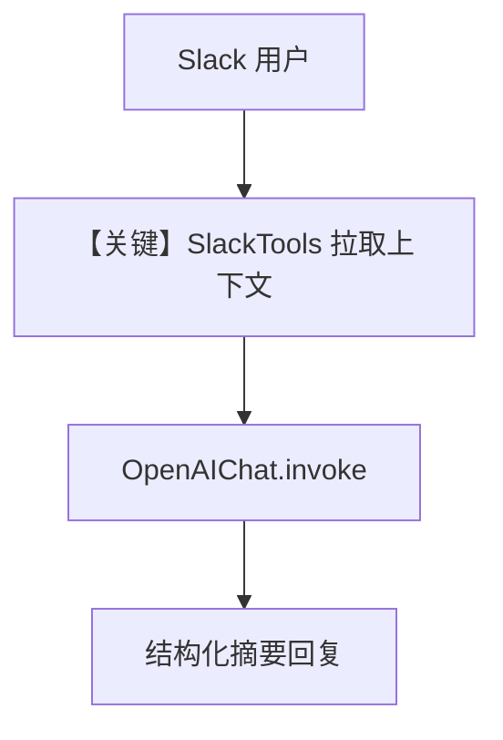

# channel_summarizer.py — 实现原理分析

> 源文件：`cookbook/05_agent_os/interfaces/slack/channel_summarizer.py`

## 概述

本示例展示 Agno 的 **SlackTools（读线程/搜消息）+ 频道摘要 Agent** 机制：代理通过工具拉取 Slack 频道与线程内容，再按固定结构输出「讨论 / 决策 / 行动项」类摘要，并依赖 `db` + 历史在同一线程追问。

**核心配置一览：**

| 配置项 | 值 | 说明 |
|--------|------|------|
| `model` | `OpenAIChat(id="gpt-4o")` | Chat Completions |
| `tools` | `SlackTools(enable_get_thread=True, enable_search_messages=True, enable_list_users=True)` | 读 Slack |
| `instructions` | 多行列表 | 摘要流程与版式 |
| `db` | `SqliteDb(..., summarizer.db)` | 会话 |
| `add_history_to_context` | `True`，`num_history_runs=5` | 追问 |
| `Slack` | `reply_to_mentions_only=True` | 仅提及 |

## 架构分层

```
Slack → Agent（带 SlackTools）→ OpenAIChat.invoke ↔ Slack API（经工具）
```

## 核心组件解析

### `SlackTools`

启用线程读取与消息搜索，使模型以 **工具调用** 方式拉取上下文，而非仅靠单条 user 文本。

### 运行机制与因果链

1. **数据路径**：用户指定频道/主题 → 模型多次 `tool_call` 拉历史 → 汇总回答。
2. **副作用**：工具调用访问 Slack API，需文档头所列 OAuth scope。

## System Prompt 组装

### 还原后的完整 System 文本（instructions 合并为可读块）

```text
You summarize Slack channel activity.
When asked about a channel:
1. Get recent message history
2. Identify active threads and expand them
3. Group messages by topic/theme
4. Highlight decisions, action items, and blockers
Format summaries with clear sections:
- Key Discussions
- Decisions Made
- Action Items
- Questions/Blockers
Use bullet points and keep summaries concise.
```

另含时间、markdown、工具说明等。

## 完整 API 请求

```python
client.chat.completions.create(
    model="gpt-4o",
    messages=[...],
    tools=[... SlackTools 函数 schema ...],
)
```

## Mermaid 流程图



## 关键源码文件索引

| 文件 | 关键函数/类 | 作用 |
|------|------------|------|
| `agno/tools/slack` | `SlackTools` | Slack API 封装 |
| `agno/models/openai/chat.py` | `invoke()` | LLM |
