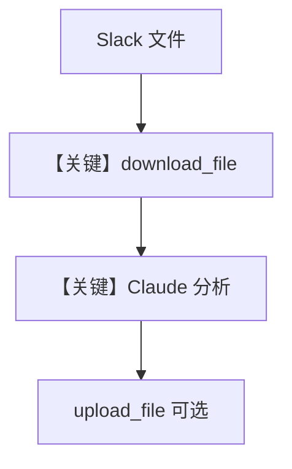

# file_analyst.py — 实现原理分析

> 源文件：`cookbook/05_agent_os/interfaces/slack/file_analyst.py`

## 概述

本示例展示 Agno 的 **Slack 文件下载/上传 + Claude 文档理解** 机制：`SlackTools` 打开 `enable_download_file`、`enable_upload_file` 与频道历史，Agent 分析用户分享的 CSV/代码/文本并可把结果作为新文件传回频道。

**核心配置一览：**

| 配置项 | 值 | 说明 |
|--------|------|------|
| `model` | `Claude(id="claude-sonnet-4-20250514")` | Anthropic Messages |
| `tools` | `SlackTools(..., output_directory="/tmp/slack_analysis")` | 下载目录 |
| `instructions` | 多行列表 | 分析策略 |
| `db` | `SqliteDb` | 会话 |
| `add_history_to_context` | `True`，`num_history_runs=5` | 是 |

## 架构分层

```
Slack 文件事件 → Agent → Claude + SlackTools（读写文件）
```

## 核心组件解析

### 本地 `output_directory`

下载文件落盘后再由模型侧读取（具体流由工具实现），便于大文件处理。

### 运行机制与因果链

多轮工具：`get_channel_history` → `download_file` → 分析 → `upload_file`。

## System Prompt 组装

### 还原后的完整 System 文本（字面量）

```text
You are a file analysis assistant.
When users share files or mention file IDs (F12345...), download and analyze them.
For CSV/data files: identify patterns, outliers, and key statistics.
For code files: explain what the code does, suggest improvements.
For text/docs: summarize key points.
You can upload analysis results back to Slack as new files.
Always explain your analysis in plain language.
```

## 完整 API 请求

使用 **Anthropic Messages API**（`Claude.invoke`），可含 `tools` 与多模态/文档块（以 `claude.py` 实现为准）。

## Mermaid 流程图



## 关键源码文件索引

| 文件 | 关键函数/类 | 作用 |
|------|------------|------|
| `agno/models/anthropic/claude.py` | `invoke()` | Anthropic |
| `agno/tools/slack` | `SlackTools` | 文件 API |
