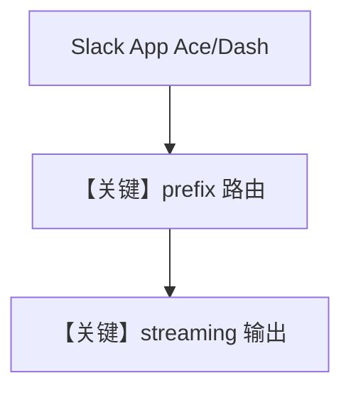

# multi_bot.py — 实现原理分析

> 源文件：`cookbook/05_agent_os/interfaces/slack/multi_bot.py`

## 概述

本示例展示 Agno 的 **同工作区双 Slack App + 不同 URL 前缀 + 流式** 机制：`Ace` 与 `Dash` 两个 Agent 共享 `SqliteDb` 文件但 **会话隔离**，各自 `Slack` 接口绑定独立 token/`prefix`（`/ace` vs `/slack`），`streaming=True` 用于验证流式与 plan UI。

**核心配置一览：**

| 配置项 | 值 | 说明 |
|--------|------|------|
| `ace_agent` / `dash_agent` | `gpt-4.1-mini`，不同 `instructions` | 人格区分 |
| `db` | 同一 `SqliteDb` | 表级会话键仍按 bot/session 区分 |
| `Slack` | `prefix`、`token`、`signing_secret` 环境变量 | 双应用 |
| `streaming` | `True` | 流式响应 |
| `reply_to_mentions_only` | `False` | 非仅提及 |

## 架构分层

```
Slack App A → /ace/events → ace_agent
Slack App B → /slack/events → dash_agent
```

## 核心组件解析

### 会话隔离

文档说明：同线程内两 bot 仍各自 session，依赖 OS/Slack 适配器对 `agent_id` 与 Slack 身份的映射。

### 运行机制与因果链

与 `multiple_instances.py` 类似，但强调 **流式** 与 **双 token** 部署。

## System Prompt 组装

### Ace instructions 字面量

```text
You are Ace, a research assistant. Always introduce yourself as Ace.
When answering, cite sources and be thorough.
```

### Dash instructions 字面量

```text
You are Dash, a concise summarizer. Always introduce yourself as Dash.
Keep answers concise - 2-3 sentences max.
```

## 完整 API 请求

`OpenAIChat.invoke` → `chat.completions.create`，流式由 AgentOS/模型层 `stream` 参数驱动。

## Mermaid 流程图



## 关键源码文件索引

| 文件 | 关键函数/类 | 作用 |
|------|------------|------|
| `agno/os/interfaces/slack` | `Slack(prefix, streaming)` | 多应用 |
