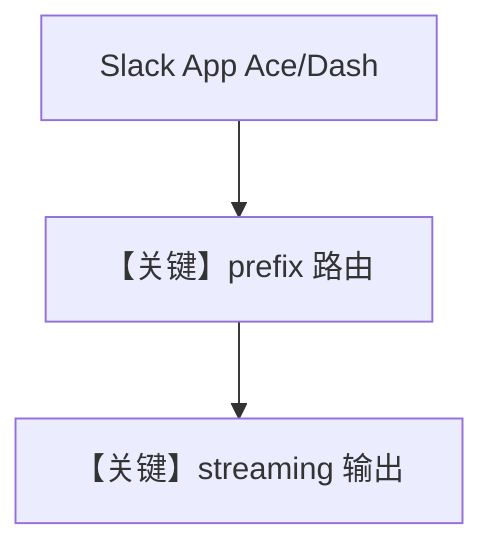

# multi_bot.py — 实现原理分析

<!-- cookbook-py-source:start -->
## 完整源码

```python
"""
Multi-Bot Streaming Test
========================

Two agents on the same Slack workspace, mounted on different prefixes.
Both use streaming mode. Tests session isolation: each bot gets its own
DB session even when responding in the same thread.

Setup:
  1. Two Slack apps (Ace + Dash) installed to the same workspace
  2. Event Subscription URLs:
       Ace  -> https://<tunnel>/ace/events
       Dash -> https://<tunnel>/slack/events
  3. Environment variables:
       ACE_SLACK_TOKEN,  ACE_SLACK_SIGNING_SECRET
       DASH_SLACK_TOKEN, DASH_SLACK_SIGNING_SECRET
  4. ngrok: ngrok http --domain=<your-subdomain>.ngrok-free.dev 7777

Slack scopes (per app): app_mentions:read, assistant:write, chat:write, im:history
"""

from os import getenv

from agno.agent import Agent
from agno.db.sqlite import SqliteDb
from agno.models.openai import OpenAIChat
from agno.os.app import AgentOS
from agno.os.interfaces.slack import Slack

db = SqliteDb(session_table="agent_sessions", db_file="tmp/multi_bot.db")

ace_agent = Agent(
    id="ace",
    name="Ace",
    model=OpenAIChat(id="gpt-4.1-mini"),
    db=db,
    instructions=[
        "You are Ace, a research assistant. Always introduce yourself as Ace.",
        "When answering, cite sources and be thorough.",
    ],
    add_history_to_context=True,
    num_history_runs=5,
    markdown=True,
)

dash_agent = Agent(
    id="dash",
    name="Dash",
    model=OpenAIChat(id="gpt-4.1-mini"),
    db=db,
    instructions=[
        "You are Dash, a concise summarizer. Always introduce yourself as Dash.",
        "Keep answers concise - 2-3 sentences max.",
    ],
    add_history_to_context=True,
    num_history_runs=5,
    markdown=True,
)

agent_os = AgentOS(
    agents=[ace_agent, dash_agent],
    interfaces=[
        Slack(
            agent=ace_agent,
            prefix="/ace",
            token=getenv("ACE_SLACK_TOKEN"),
            signing_secret=getenv("ACE_SLACK_SIGNING_SECRET"),
            streaming=True,
            reply_to_mentions_only=False,
        ),
        Slack(
            agent=dash_agent,
            prefix="/slack",
            token=getenv("DASH_SLACK_TOKEN"),
            signing_secret=getenv("DASH_SLACK_SIGNING_SECRET"),
            streaming=True,
            reply_to_mentions_only=False,
        ),
    ],
)
app = agent_os.get_app()

if __name__ == "__main__":
    agent_os.serve(app="multi_bot:app", reload=True)
```

<!-- cookbook-py-source:end -->

> 源文件：`cookbook/05_agent_os/interfaces/slack/multi_bot.py`

## 概述

本示例展示 Agno 的 **同工作区双 Slack App + 不同 URL 前缀 + 流式** 机制：`Ace` 与 `Dash` 两个 Agent 共享 `SqliteDb` 文件但 **会话隔离**，各自 `Slack` 接口绑定独立 token/`prefix`（`/ace` vs `/slack`），`streaming=True` 用于验证流式与 plan UI。

**核心配置一览：**

| 配置项 | 值 | 说明 |
|--------|------|------|
| `ace_agent` / `dash_agent` | `gpt-4.1-mini`，不同 `instructions` | 人格区分 |
| `db` | 同一 `SqliteDb` | 表级会话键仍按 bot/session 区分 |
| `Slack` | `prefix`、`token`、`signing_secret` 环境变量 | 双应用 |
| `streaming` | `True` | 流式响应 |
| `reply_to_mentions_only` | `False` | 非仅提及 |

## 架构分层

```
Slack App A → /ace/events → ace_agent
Slack App B → /slack/events → dash_agent
```

## 核心组件解析

### 会话隔离

文档说明：同线程内两 bot 仍各自 session，依赖 OS/Slack 适配器对 `agent_id` 与 Slack 身份的映射。

### 运行机制与因果链

与 `multiple_instances.py` 类似，但强调 **流式** 与 **双 token** 部署。

## System Prompt 组装

### Ace instructions 字面量

```text
You are Ace, a research assistant. Always introduce yourself as Ace.
When answering, cite sources and be thorough.
```

### Dash instructions 字面量

```text
You are Dash, a concise summarizer. Always introduce yourself as Dash.
Keep answers concise - 2-3 sentences max.
```

## 完整 API 请求

`OpenAIChat.invoke` → `chat.completions.create`，流式由 AgentOS/模型层 `stream` 参数驱动。

## Mermaid 流程图



## 关键源码文件索引

| 文件 | 关键函数/类 | 作用 |
|------|------------|------|
| `agno/os/interfaces/slack` | `Slack(prefix, streaming)` | 多应用 |
